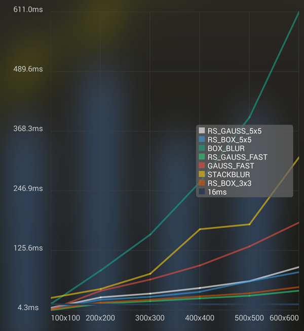
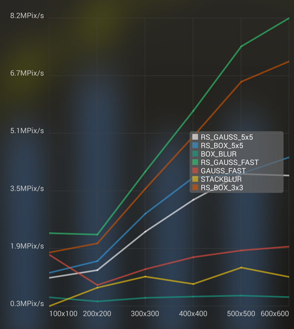
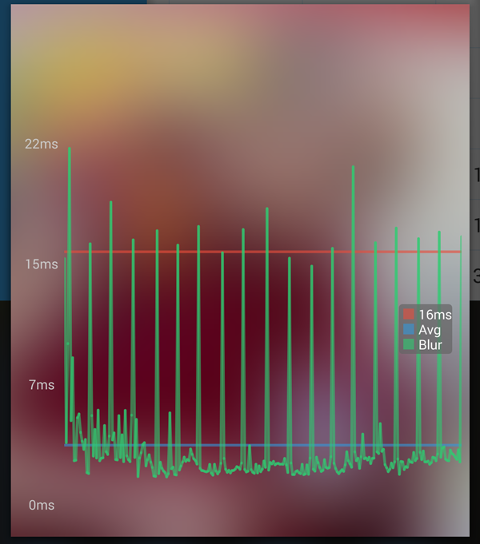
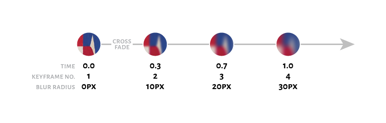

Android Blur Guide 2016
-----------------------

[with Showcase/Benchmark App](https://play.google.com/store/apps/details?id=at.favre.app.blurbenchmark) and [Source on GitHub](https://github.com/patrickfav/BlurTestAndroid). _Also check out the Blur framework I'm currently working on: [Dali](https://github.com/patrickfav/Dali)._

After experimenting a lot I can now safely give you some solid recommendations that will make your life easier in Android when using the Android Framework.

Load and Use a down scaled Bitmap (for very blurry images)
----------------------------------------------------------

Never use the full size of a Bitmap. The bigger the image the more needs to be blurred and also the higher the blur radius needs to be and usually, the higher the blur radius the longer the algorithm takes.

```java
final BitmapFactory.Options options = new BitmapFactory.Options();
options.inSampleSize = 8;
Bitmap blurTemplate = BitmapFactory.decodeResource(getResources(), R.drawable.myImage, options);

```

This will load the bitmap with `inSampleSize` 8, so only 1/64 of the original image. Test what `inSampleSize` suits your needs, but keep it 2^n (2,4,8,...) to avoid degrading quality due to scaling. [See Google doc for more](http://developer.android.com/training/displaying-bitmaps/load-bitmap.html#load-bitmap)

Another huge advantage is that bitmap loading will be really fast. In my early blur testing I figured that the longest time during the whole blur process was the image loading. So to load a 1920x1080 image from disk my Nexus 5 needed 500ms while the blurring only took another 250 ms or so.

Use Renderscript
----------------

Renderscript provides [`ScriptIntrinsicBlur`](http://developer.android.com/reference/android/renderscript/ScriptIntrinsicBlur.html) which is a Gaussian blur filter. It has good visual quality and is just the fastest you realistically get on Android. Google claims to be ["typically 2-3x faster than a multithreaded C implementation and often 10x+ faster than a Java implementation"](http://android-developers.blogspot.co.at/2013/08/renderscript-intrinsics.html). Renderscript is really sophisticated (using the fastest processing device (GPU, ISP, etc.), etc.) and there is also the [v8 support library for it making it compatible down to 2.2](http://developer.android.com/guide/topics/renderscript/compute.html#access-rs-apis). Well at least in theory, through my own tests and reports from other devs it seems that it is not possible to use Renderscript blindly, since the hardware/driver fragmentation seems to cause problems with some devices, even with higher SDK level (e.g. I had troubles with the 4.1 Nexus S) so be careful and test on a lot of devices. Here's a simple example that will get you started:

```java
//define this only once if blurring multiple times
RenderScript rs = RenderScript.create(context);

(...)
//this will blur the bitmapOriginal with a radius of 8 and save it in bitmapOriginal
final Allocation input = Allocation.createFromBitmap(rs, bitmapOriginal); //use this constructor for best performance, because it uses USAGE_SHARED mode which reuses memory
final Allocation output = Allocation.createTyped(rs, input.getType());
final ScriptIntrinsicBlur script = ScriptIntrinsicBlur.create(rs, Element.U8_4(rs));
script.setRadius(8f);
script.setInput(input);
script.forEach(output);
output.copyTo(bitmapOriginal);

```

When using the v8 support with Gradle, which is specifically recommended by Google ["because they include the latest improvements"](http://developer.android.com/guide/topics/renderscript/compute.html#access-rs-apis), you only [need to add 2 lines to your build script](http://android-developers.blogspot.co.at/2013/09/renderscript-in-android-support-library.html) and use `android.support.v8.renderscript` with current build tools ([updated syntax for android Gradle plugin v14+](http://tools.android.com/tech-docs/new-build-system))

```
android {
    ...
    defaultConfig {
        ...
        renderscriptTargetApi 19
        renderscriptSupportModeEnabled true
    }
}

```

Simple benchmark on a Nexus 5 - comparing RenderScript with different other java and Renderscript implementations:

 The average runtime per blur on different pic sizes

 Megapixels per sec that can be blurred

Each value is the avg of 250 rounds. `RS_GAUSS_FAST` is `ScriptIntrinsicBlur` (and nearly always the fastest), others that start with `RS_` are mostly convolve implementations with simple kernels. [The details of the algorithms can be found here](https://github.com/patrickfav/BlurTestAndroid). This is not purely blurring, since a good portion is garbage collection that is measured. This can be seen in this here (`ScriptIntrinsicBlur` on a 100x100 image with about 500 rounds)



The spikes are gc.

You can check for yourself, the benchmark app is in the Playstore: [BlurBenchmark](https://play.google.com/store/apps/details?id=at.favre.app.blurbenchmark)

Reuses Bitmap wherever possible (if priority: performance > memory footprint)
-----------------------------------------------------------------------------

If you need multiple blurs for a live blur or similar and your memory allows it, do not load the bitmap from drawables multiple times, but keep it "cached" in a member variable. In this case always try to use the same variables, to keep garbage collecting to a minimum.

Also check out the new [`inBitmap` option when loading](http://developer.android.com/training/displaying-bitmaps/manage-memory.html#inBitmap) from a file or drawable which will reuse the bitmap memory and save garbage collection time.

For blending from sharp to blurry
---------------------------------

The simple and naive method is just to use 2 `ImageViews`, one blurred, and alpha fade them. But if you want a more sophisticated look that smoothly fades from sharp to blurry, then check out [Roman Nurik's post about how to do it like in his Muzei app](https://plus.google.com/+RomanNurik/posts/2sTQ1X2Cb2Z).

Basically he explains that he pre-blurs some frames with different blur extents and uses them as key frames in an animation that looks really smooth.


