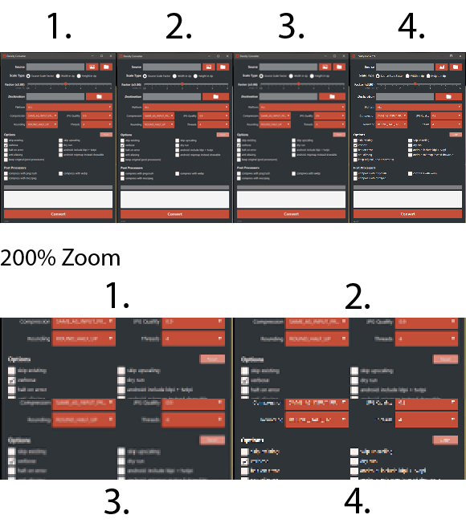

The two most popular open source libs specializing in image resizing in java currently are:

*   [Thumbnailator](https://github.com/coobird/thumbnailator)
*   [imgscalr](https://github.com/thebuzzmedia/imgscalr)

Additonal there is the JDK way with Java's [`Graphics2D`](https://docs.oracle.com/javase/7/docs/api/java/awt/Graphics2D.html) ([see this question on how to do it](https://stackoverflow.com/questions/4756268/how-to-resize-the-buffered-image-n-graphics-2d-in-java)) which is notorious to create [bad results especially with downscaling](https://stackoverflow.com/questions/14115950/quality-of-image-after-resize-very-low-java). There is also a [Java interface to ImageMagick](http://im4java.sourceforge.net/) which will be omitted here because it requires an external tool.

Visual Quality
==============

Here is a comparison of the results of resizing/downscaling a `580x852` png to `145x213`. As reference Photoshop CS5 "save for web" resizing is used. _Note: the results are 1:1 what the libs created just copied together. The zoom does not use any filtering, just a simple nearest neighbor algorithm._ [Here you can find the original image.](https://i.stack.imgur.com/RmQLa.png)

> 1.  Thumbnailator 0.4.8 with default settings, no dimension adjustments
> 2.  Photoshop CS5 with bicubic algorithm
> 3.  imgscalr 4.2 with ULTRA\_QUALITY setting, no dimension adjustments
> 4.  Graphics2D (Java 8) with render hints VALUE\_INTERPOLATION\_BICUBIC, VALUE\_RENDER\_QUALITY, VALUE\_ANTIALIAS\_ON

I leave it to the reader to select the best result as this is subjective. Generally, all have good output except `Graphics2D`. Thumbnailator generates sharper images very similar to Photoshop output, whereas imgscalr's output is considerably softer. For icons/text etc. you want a sharper output, for pictures you may want softer output.

Computational Time
==================

Here is non-scientific benchmark using this [tool](https://github.com/patrickfav/density-converter) and 114 images with dimension from about `96x96` up to `2560x1440` treating it as 425% images creating: 100%, 150%, 200%, 300% and 400% scaled versions of it (so 114 \* 5 scaling operations). All libs use the same settings as in the quality comparison (so highest quality possible). Times are only scaling not the whole process. Done on a i5-2520M with 8GB Ram and 5 runs.

> *   **Thumbnailator**: 7003.0ms | 6581.3ms | 6019.1ms | 6375.3ms | 8700.3ms
> *   **imgscalr**: 25218.5ms | 25786.6ms | 25095.7ms | 25790.4ms | 29296.3ms
> *   **Graphics2D**: 7387.6ms | 7177.0ms | 7048.2ms | 7132.3ms | 7510.3ms

[Here is the code used in this benchmark.](https://gist.github.com/patrickfav/a147ecd26a385ce4f6d8c373356454c4)

Interestingly **Thumbnailator is also the fastest with an average time of 6.9 sec** followed by **Java2D with 7.2 sec** leaving **imgscalr behind with a poor 26.2 sec**. This is probably not fair since imgscalr is set to `ULTRA_QUALITY` which seems to be extremely expensive; with the `QUALITY` setting it averages at a more competitive 11.1 sec.