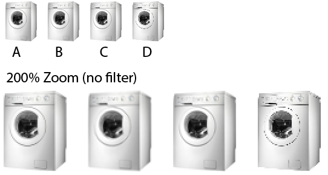

As already stated, Java's Graphics2D does not provide a very good algorithm for down-scaling. If you don't want to implement a sophisticated algorithm yourself you could try out the current open source libs specialized for this: [Thumbnailator](so_a2bd2e40d277da38e454ab52.png), [imgscalr](https://gist.github.com/patrickfav/a147ecd26a385ce4f6d8c373356454c4) and a Java interface for [ImageMagick](https://stackoverflow.com/a/36295066/774398).

While researching for a private project I tried them out (except ImageMagick) and here are the visual results with Photoshop as reference:

> A. **Thumbnailator** 0.4.8 with default settings (no additional internal resizing)  
> B. **imgscalr** 4.2 with ULTRA\_QUALTY setting  
> C. **Photoshop** CS5 bicubic filter (save for web)  
> D. **Graphics2d** with all HQ render hints

[_Here is the used code_](https://gist.github.com/patrickfav/a147ecd26a385ce4f6d8c373356454c4)

Thumbnailator and PS create similar results, while imgscalr seems to be softer. It is subjective which one of the libs creates the preferable results. Another point to consider though is the performance. While Thumbnailator and Graphics2d have similar runtime, imgscalr is considerably slower (with ULTRA\_QUALITY) [in my benchmarks](https://stackoverflow.com/a/36295066/774398).

[For more info, read this post providing more detail on this matter](https://stackoverflow.com/a/36295066/774398).