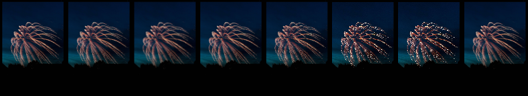
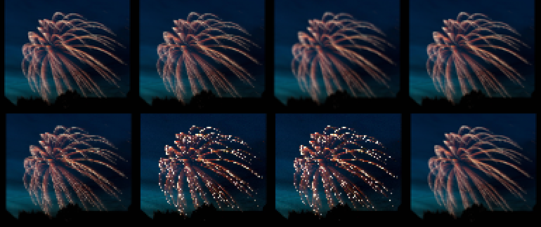
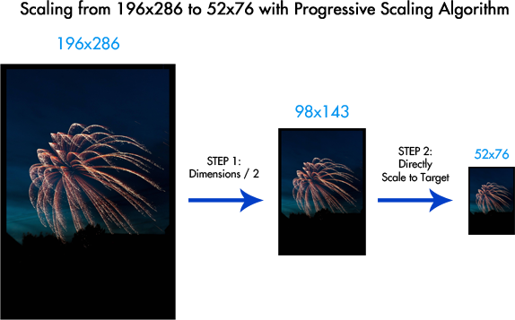

 This was originally posted as an [answer](https://stackoverflow.com/a/36367652/774398) to this [question](https://stackoverflow.com/questions/24745147/java-resize-image-without-losing-quality)  on stackoverflow.com

Unfortunately, there is no recommended out-of-the-box scaling in Java that provides visually good results. Among others, here are the methods I recommend for scaling:

*   Lanczos3 Resampling (usually visually better, but slower)
*   Progressive Down Scaling (usually visually fine, can be quite fast)
*   One-Step scaling for up scaling (with  `Graphics2d`  bicubic fast and good results, usually not as good as Lanczos3)

Examples for every method can be found in this answer.

Visual Comparison
=================

Here is your image scaled to  `96x140`  with different methods/libs. Click on the image to get the full size:

[](so_88f7582f7c8daf58d03df108.png)

[](so_8421b1333f5a2a54f4893b62.png)

1.  Morten Nobel's lib Lanczos3
2.  Thumbnailator Bilinear Progressive Scaling
3.  Imgscalr ULTRA\_QUALTY (1/7 step Bicubic Progressive Scaling)
4.  Imgscalr QUALTY (1/2 step Bicubic Progressive Scaling)
5.  Morten Nobel's lib Bilinear Progressive Scaling
6.   `Graphics2d`  Bicubic interpolation
7.   `Graphics2d`  Nearest Neighbor interpolation
8.  Photoshop CS5 bicubic as reference

Unfortunately a single image is not enough to judge a scaling algorithm, you should test icons with sharp edges, photos with text, etc.

Lanczos Resampling
==================

Is said to be good for up- and especially downscaling. Unfortunately [there is no native implementation in current JDK](http://bugs.java.com/bugdatabase/view_bug.do?bug_id=6500894) so you either implement it yourself and use a lib like [Morten Nobel's lib](https://github.com/mortennobel/java-image-scaling). A simple example using said lib:

```
ResampleOp resizeOp = new ResampleOp(dWidth, dHeight);
resizeOp.setFilter(ResampleFilters.getLanczos3Filter());
BufferedImage scaledImage = resizeOp.filter(imageToScale, null);

```

The lib is [published on maven-central](http://mvnrepository.com/artifact/com.mortennobel/java-image-scaling) which is not mentioned unfortunately. The downside is that it usually is very slow without any highly optimized or hardware accelerated implementations known to me. Nobel's implementation is about 8 times slower than a 1/2 step progressive scaling algorithm with  `Graphics2d` . [Read more about this lib on his blog](https://blog.nobel-joergensen.com/2008/12/20/downscaling-images-in-java/).

Progressive Scaling
===================

Mentioned in [Chris Campbell's blog about scaling](https://community.oracle.com/docs/DOC-983611) in Java, progressive scaling is basically incrementally scaling an image in smaller steps until the final dimensions are reached. Campbell describes it as halving width/height until you reach target. This produces good results and can be used with  `Graphics2D`  which can be hardware accelerated, therefore usually having very good performance with acceptable results in most cases. The major downside of this is if downscaled less than half using  `Graphics2D`  provides the same mediocre results since it is only scaled once.

Here is a simple example on how it works:

[](so_1b4fccc08d1d51f681a8dc71.png)

The following libs incorporate forms of progressive scaling based on  `Graphics2d` :

[Thumbnailator v0.4.8](https://github.com/coobird/thumbnailator)
----------------------------------------------------------------

Uses the progressive bilinear algorithm if the target is at least half of every dimension, otherwise it uses simple  `Graphics2d`  bilinear scaling and bicubic for upscaling.

```
Resizer resizer = DefaultResizerFactory.getInstance().getResizer(
  new Dimension(imageToScale.getWidth(), imageToScale.getHeight()), 
  new Dimension(dWidth, dHeight))
BufferedImage scaledImage = new FixedSizeThumbnailMaker(
  dWidth, dHeight, false, true).resizer(resizer).make(imageToScale);

```

It is as fast or slightly faster than one-step scaling with  `Graphics2d`  scoring an average of 6.9 sec in my [benchmark](https://stackoverflow.com/a/36295066/774398).

[Imgscalr v4.2](https://github.com/thebuzzmedia/imgscalr)
---------------------------------------------------------

Uses progressive bicubic scaling. In the  `QUALITY`  setting it uses Campbell style algorithm with halving the dimensions every step while the  `ULTRA_QUALITY`  has finer steps, reducing the size every increment by 1/7 which generates generally softer images but minimizes the instances where only 1 iteration is used.

```
BufferedImage scaledImage = Scalr.resize(imageToScale, Scalr.Method.ULTRA_QUALITY, Scalr.Mode.FIT_EXACT, dWidth, dHeight, bufferedImageOpArray);

```

The major downside is performance.  `ULTRA_QUALITY`  is considerably slower than the other libs. Even  `QUALITY`  a bit slower than Thumbnailator's implementation. My simple [benchmark](https://stackoverflow.com/a/36295066/774398) resulted in 26.2 sec and 11.1 sec average respectively.

[Morten Nobel's lib v0.8.6](https://github.com/mortennobel/java-image-scaling)
------------------------------------------------------------------------------

Has also implementations for progressive scaling for all basic  `Graphics2d`  (bilinear, bicubic & nearest neighbor)

```
BufferedImage scaledImage = new MultiStepRescaleOp(dWidth, dHeight, RenderingHints.VALUE_INTERPOLATION_BILINEAR).filter(imageToScale, null);

```

A word on JDK Scaling Methods
=============================

Current jdk way to scale an image would be something like this

```
scaledImage = new BufferedImage(dWidth, dHeight, imageType);
Graphics2D graphics2D = scaledImage.createGraphics();
graphics2D.setRenderingHint(RenderingHints.KEY_INTERPOLATION, RenderingHints.VALUE_INTERPOLATION_BILINEAR);
graphics2D.drawImage(imageToScale, 0, 0, dWidth, dHeight, null);
graphics2D.dispose();

```

but most are very disappointed with the result of downscaling no matter what interpolation or other  `RenderHints`  are used. On the other hand upscaling seems to produce acceptable images (best would be bicubic). In previous JDK version (we talking 90s v1.1)  `Image.getScaledInstance()`  was introduced which provided good visual results with parameter  `SCALE_AREA_AVERAGING`  but you are discouraged to use it - [read the full explanation here](https://community.oracle.com/docs/DOC-983611).