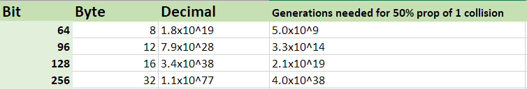

This is easily achievable without any external libraries.

1\. Cryptographic Pseudo Random Data Generation (PRNG)
======================================================

First you need a cryptographic PRNG. Java has [ `SecureRandom` ](https://docs.oracle.com/javase/8/docs/api/java/security/SecureRandom.html) for that and typically uses the best entropy source on the machine (e.g.  `/dev/random` ). [Read more here](https://tersesystems.com/2015/12/17/the-right-way-to-use-securerandom/).

```
SecureRandom rnd = new SecureRandom();
byte[] token = new byte[byteLength];
rnd.nextBytes(token);

```

_**Note:**_  `SecureRandom`  is the slowest, but most secure way in Java of generating random bytes. I do however recommend _not_ considering performance here since it usually has no real impact on your application unless you have to generate millions of tokens per second.

2\. Required Space of Possible Values
=====================================

Next you have to decide "how unique" your token needs to be. The whole and only point of considering entropy is to make sure that the system can resist brute force attacks: the space of possible values must be so large that any attacker could only try a negligible proportion of the values in non-ludicrous time[1](https://security.stackexchange.com/a/102163/60108).

Unique identifiers such as random [ `UUID` ](https://en.wikipedia.org/wiki/Universally_unique_identifier) have 122 bit of entropy (i.e., 2^122 = 5.3x10^36) - the chance of collision is "\*(...) for there to be a one in a billion chance of duplication, 103 trillion version 4 UUIDs must be generated[2](https://en.wikipedia.org/wiki/Universally_unique_identifier#Collisions)". **We will choose 128 bits since it fits exactly into 16 bytes** and is seen as [highly sufficient](https://security.stackexchange.com/questions/6141/amount-of-simple-operations-that-is-safely-out-of-reach-for-all-humanity/6149#6149) for being unique for basically every, but the most extreme, use cases and you don't have to think about duplicates. Here is a simple comparison table of entropy including simple analysis of the [birthday problem](https://en.wikipedia.org/wiki/Birthday_problem).

[](so_46efbd1d00c67dd990ca12d4.png)

For simple requirements, 8 or 12 byte length might suffice, but with 16 bytes you are on the "safe side".

And that's basically it. The last thing is to think about encoding so it can be represented as a printable text (read, a  `String` ).

3\. Binary to Text Encoding
===========================

Typical encodings include:

*   [ `Base64` ](https://en.wikipedia.org/wiki/Base64) every character encodes 6 bit, creating a 33% overhead. Fortunately there are standard implementations in [Java 8+](https://docs.oracle.com/javase/8/docs/api/java/util/Base64.html) and [Android](https://developer.android.com/reference/android/util/Base64.html). With older Java you can use any of the [numerous third-party libraries](https://stackoverflow.com/questions/13109588/base64-encoding-in-java). If you want your tokens to be URL safe use the [URL-safe](https://en.wikipedia.org/wiki/Base64#URL_applications) version of RFC4648 (which usually is supported by most implementations). Example encoding 16 bytes with padding:  `XfJhfv3C0P6ag7y9VQxSbw==` 
    
*   [ `Base32` ](https://en.wikipedia.org/wiki/Base32) every character encodes 5 bit, creating a 40% overhead. This will use  `A-Z`  and  `2-7` , making it reasonably space efficient while being case-insensitive alpha-numeric. There isn't any [standard implementation in the JDK](https://stackoverflow.com/questions/21515479/encode-string-to-base32-string-in-java). Example encoding 16 bytes without padding:  `WUPIL5DQTZGMF4D3NX5L7LNFOY` 
    
*   [ `Base16` ](https://en.wikipedia.org/wiki/Hexadecimal) (hexadecimal) every character encodes four bit, requiring two characters per byte (i.e., 16 bytes create a string of length 32). Therefore hexadecimal is less space efficient than  `Base32` , but it is safe to use in most cases (URL) since it only uses  `0-9`  and  `A`  to  `F` . Example encoding 16 bytes:  `4fa3dd0f57cb3bf331441ed285b27735` . [See a Stack Overflow discussion about converting to hexadecimal here](https://stackoverflow.com/a/58118078/774398).
    

Additional encodings like [Base85](https://en.wikipedia.org/wiki/Ascii85#RFC_1924_version) and the exotic [Base122](http://blog.kevinalbs.com/base122) exist with better/worse space efficiency. You can create your own encoding (which basically most answers in this thread do), but I would advise against it, if you don't have very specific requirements. See [more encoding schemes in the Wikipedia article](https://en.wikipedia.org/wiki/Binary-to-text_encoding).

4\. Summary and Example
=======================

*   Use [ `SecureRandom` ](https://docs.oracle.com/javase/8/docs/api/java/security/SecureRandom.html)
*   Use at least 16 bytes (2^128) of possible values
*   Encode according to your requirements (usually  `hex`  or  `base32`  if you need it to be alpha-numeric)

**Don't**

*   ... use your home brew encoding: _better maintainable and readable for others if they see what standard encoding you use instead of weird _for_ loops creating characters at a time._
*   ... use UUID: _it has no guarantees on randomness; you are wasting 6 bits of entropy and have a verbose string representation_

Example: Hexadecimal Token Generator
------------------------------------

```
public static String generateRandomHexToken(int byteLength) {
    SecureRandom secureRandom = new SecureRandom();
    byte[] token = new byte[byteLength];
    secureRandom.nextBytes(token);
    return new BigInteger(1, token).toString(16); // Hexadecimal encoding
}

//generateRandomHexToken(16) -> 2189df7475e96aa3982dbeab266497cd

```

Example: Base64 Token Generator (URL Safe)
------------------------------------------

```
public static String generateRandomBase64Token(int byteLength) {
    SecureRandom secureRandom = new SecureRandom();
    byte[] token = new byte[byteLength];
    secureRandom.nextBytes(token);
    return Base64.getUrlEncoder().withoutPadding().encodeToString(token); //base64 encoding
}

//generateRandomBase64Token(16) -> EEcCCAYuUcQk7IuzdaPzrg

```

Example: Java CLI Tool
----------------------

If you want a ready-to-use CLI tool you may use [dice](https://github.com/patrickfav/dice):

Example: Related issue - Protect Your Current Ids
-------------------------------------------------

If you already have an id you can use (e.g., a synthetic  `long`  in your entity), but [don't want to publish the internal value](https://medium.com/@patrickfav/a-better-way-to-protect-your-database-ids-a33fa9867552), you can use this library to encrypt it and obfuscate it: [https://github.com/patrickfav/id-mask](https://github.com/patrickfav/id-mask)

```
IdMask<Long> idMask = IdMasks.forLongIds(Config.builder(key).build());
String maskedId = idMask.mask(id);
// Example: NPSBolhMyabUBdTyanrbqT8
long originalId = idMask.unmask(maskedId);

```