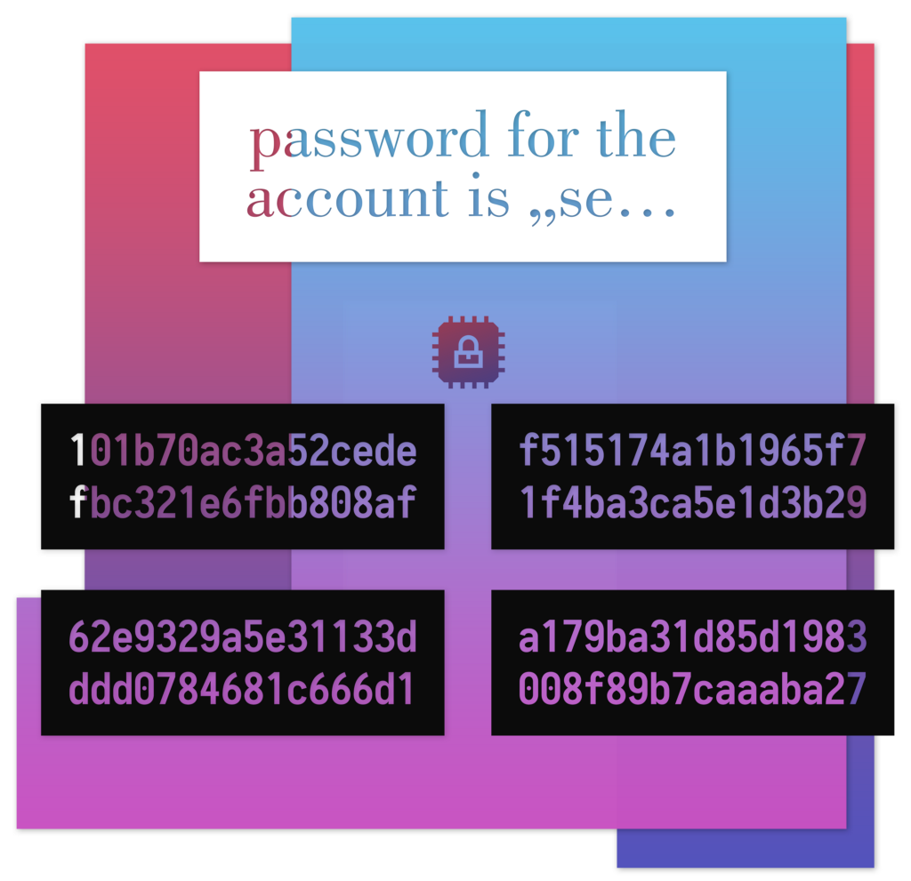

In this article I will bring you up to speed on the Advanced Encryption Standard (AES), common block modes, why you need padding and initialization vectors and how to protect your data against modification. Finally, I will show you how to easily implement this with Java avoiding common security issues.



#### What every Software Engineer should know about AES

AES, also known by its original name Rijndael, was selected by the [NIST](https://en.wikipedia.org/wiki/National_Institute_of_Standards_and_Technology) in 2000 to find a successor for the dated [Data Encryption Standard](https://en.wikipedia.org/wiki/Data_Encryption_Standard)(DES). AES is a block cipher, that means encryption happens on fixed-length groups of bits. In our case the algorithm defines 128 bit blocks. AES supports key lengths of 128, 192 and 256 bit.

Every block goes through many cycles of transformation rounds. I will omit the details of the algorithm here, but the interested reader is referred to the [Wikipedia article about AES](https://en.wikipedia.org/wiki/Advanced_Encryption_Standard#High-level_description_of_the_algorithm). The important part is that the key length does not affect the block size but the number of repetitions of transformation rounds (128-bit key is 10 cycles, 256 bit is 14)

> Until May 2009, the only successful published attacks against the full AES were [side-channel attacks](https://en.wikipedia.org/wiki/Side-channel_attack) on some specific implementations. ([Source](https://en.wikipedia.org/wiki/Advanced_Encryption_Standard#Security))

#### Want to encrypt more than one Block?

So AES will only encrypt 128 bit of data, but if we want to encrypt whole messages we need to choose a block mode with which multiple blocks can be encrypted to a single cipher text. The simplest block mode is [Electronic Codebook or ECB](https://en.wikipedia.org/wiki/Block_cipher_mode_of_operation#Electronic_Codebook_(ECB)). It uses the same unaltered key on every block like this:


Image from Wikpedia

This is particularly bad since identical plaintext blocks are encrypted to identical ciphertext blocks.


Image encrypted with ECB block mode reveals patterns of the original ([try yourself](https://gist.github.com/patrickfav/13b2f727eaf91e3a72d87ac427485cb1))

Remember to **never choose this mode unless you only encrypt data smaller than 128 bit.** Unfortunately it is still often misused because it does not require you to provide an initial vector (more about that later) and therefore _seems_ to be easier to handle for a developer.

One case has to be handled with block modes though: what happens if the last block is not _exactly_ 128 bit? That’s where [**padding**](https://en.wikipedia.org/wiki/Padding_(cryptography)) comes into play, that is, filling the missing bits of the block up. The simplest of which just fills the missing bits with zeros. There is practically [no security implication in the choice of padding](https://crypto.stackexchange.com/a/1488/44838) in AES.

#### Cipher Block Chaining (CBC)

So what alternatives to ECB are there? For one there is CBC which [XOR](https://en.wikipedia.org/wiki/Exclusive_or)s the current plaintext block with the previous ciphertext block. [This way, each ciphertext block depends on all plaintext blocks processed up to that point.](https://en.wikipedia.org/wiki/Block_cipher_mode_of_operation#Cipher_Block_Chaining_(CBC)) Using the same image as before the result would be noise not distinguishable from random data:


Image encrypted with CBC block mode looks random

So what about the first block? The easiest way is to just use a block full of e.g. zeros, but then every encryption with the same key and plaintext would result in the same ciphertext. Also, if you reuse the same key for different plaintexts it would make it easier to recover the key. A better way is to use a random [**initialization vector**](https://en.wikipedia.org/wiki/Initialization_vector) **(IV).** This is just a fancy word for random data that is about the size of one block (128 bit). Think about it like the [**salt** of the encryption](https://security.stackexchange.com/questions/6058/is-real-salt-the-same-as-initialization-vectors), that is, an IV can be public, should be random and only used one time. Mind though, that not knowing the IV will only hinder the decryption of the first block since the CBC XORs the ciphertext not the plaintext of the previous one.

When transmitting or persisting the data it is common to just prepend the IV to the actual cipher message. If you are interested on how to correctly use [AES-CBC check out part 2](https://proandroiddev.com/security-best-practices-symmetric-encryption-with-aes-in-java-and-android-part-2-b3b80e99ad36) of this series.

#### Counter Mode (CTR)

Another option is to use CTR mode. This block mode is interesting because it [turns a block cipher into a stream cipher](https://en.wikipedia.org/wiki/Block_cipher_mode_of_operation#Counter_(CTR)) which means no padding is required. In its basic form all blocks are numbered from 0 to n. Every block will now be encrypted with the key, the IV (also called _nonce_ here) and the counter value.


Image from Wikpedia

The advantage is, unlike CBC, encryption can be done in parallel and all blocks are depended on the IV not only the first one. A big caveat is, that an IV **must never be reused** with the same key because an attacker can [trivially calculate](https://crypto.stackexchange.com/a/2993/44838) the used key from that.

#### Can I be sure that nobody altered my message?

The hard truth: _encryption does not automatically protect_ against data modification. It is actually a [pretty](https://en.wikipedia.org/wiki/Padding_oracle_attack) [common](https://en.wikipedia.org/wiki/Transport_Layer_Security#BEAST_attack) [attack](https://en.wikipedia.org/wiki/Lucky_Thirteen_attack). [Read here](https://security.stackexchange.com/a/33576/60108) on a more thorough discussion about this issue.

So what can we do? We just add [Message Authentication Code (MAC)](https://en.wikipedia.org/wiki/Message_authentication_code) to the encrypted message. A MAC is similar to a digital signature, with the difference that the verifying and authenticating key are practically the same. [There are different variations](https://en.wikipedia.org/wiki/Authenticated_encryption#Approaches_to_authenticated_encryption) of this method, the mode that is [recommended by most researchers is called Encrypt-then-Mac](https://crypto.stackexchange.com/a/224/44838). That is, after encryption a MAC is calculated on the cipher text and appended. You would usually use [Hash-based message authentication code (HMAC)](https://en.wikipedia.org/wiki/Hash-based_message_authentication_code) as type of MAC.

So now it starts getting complicated. For integrity/authenticity we have to choose a MAC algorithm, choose an encryption tag mode, calculate the mac and append it. This is also slow since the whole message must be processed twice. The opposite side has to do the same but for decrypting and verifying.

#### Authenticated Encryption with GCM

Wouldn’t it be great if there were modes which handled all the authentication stuff for you? Fortunately there is a thing called [authenticated encryption](https://en.wikipedia.org/wiki/Authenticated_encryption) which simultaneously provides confidentiality, integrity, and authenticity assurances on the data. One of the most popular block modes that supports this is called [**Galois/Counter Mode**](https://en.wikipedia.org/wiki/Galois/Counter_Mode) **or GCM** for short (it is e.g. also available as a [cipher suite in TLS v1.2](https://tools.ietf.org/html/rfc5288))

GCM is basically CTR mode which also calculates an authentication tag sequentially during encryption. This authentication tag is then usually appended to the cipher text. Its size is an important security property, so it should be at least 128 bit long.

It is also possible to authenticate additional information not included in the plaintext. This data is called [**associated data**](https://en.wikipedia.org/wiki/Authenticated_encryption#Authenticated_Encryption_with_Associated_Data)**.** Why is this useful? For example the encrypted data has a meta property, the creation date, which is used to check if the content must be re-encrypted. An attacker could now trivially change the creation date, but if it is added as associated data, GCM will also verify this piece of information and recognize the change.

#### A heated discussion: What Key Size to use?

So intuition says: the bigger, the better — it is obvious that it is harder to brute force a 256-bit random value than a 128 bit. With our current understanding brute forcing through all values of a 128 bit long word would require [astronomically amount of energy](https://security.stackexchange.com/a/6149/60108), not realistic for anyone in sensible time (looking at you, NSA). So the decision is basically between (practically) infinite and infinite times 2¹²⁸.

> AES actually has three distinct key sizes because it has been chosen as a US Federal Algorithm Apt at being used in various areas under the control of the US federal government \[including the military\]. (…) So the fine military brains came up with the idea that there should be **three** ”security levels”, so that the most important secrets were encrypted with the heavy methods that they deserved, but the data of lower tactical value could be encrypted with more practical, if weaker, algorithms. (…) So the [NIST](http://en.wikipedia.org/wiki/National_Institute_of_Standards_and_Technology) decided to formally follow the regulations (ask for three key sizes) but to also do the smart thing (the lowest level had to be unbreakable with foreseeable technology)([Source](https://security.stackexchange.com/a/19762/60108))

The argument follows: an AES encrypted message probably won’t be broken by brute forcing the key, but by other less expensive attacks (not currently known). These attacks will be as harmful to 128-bit key mode as to the 256 bit mode, so choosing a bigger key size doesn’t help in this case.

So basically 128-bit key is enough security for most of every use case except [quantum computer protection](https://en.wikipedia.org/wiki/Grover%27s_algorithm). Also using 128 bit encrypts faster than 256 bit and the [key-schedule](https://en.wikipedia.org/wiki/Rijndael_key_schedule) for 128-bit keys [seems to be better protected](https://crypto.stackexchange.com/a/5120/44838) against [related-key attacks](https://en.wikipedia.org/wiki/Related-key_attack) (however this is [irrelevant to most real-world](https://crypto.stackexchange.com/a/1554/44838) uses).

#### As a Side Note: Side Channel Attacks

[Side channel attacks](https://en.wikipedia.org/wiki/Side-channel_attack) are attacks that aim to exploit issues [specific to certain implementations](https://crypto.stackexchange.com/questions/26186/is-there-a-cryptographic-algorithm-which-is-immune-to-side-channel-attacks/26187#26187). Encryption cipher schemes themselves cannot be inherently protected against them. Simple AES implementations may be prone to [timing](https://crypto.stackexchange.com/questions/5526/aes-timing-attacks) and [caching](https://crypto.stackexchange.com/questions/55896/aes-cache-timing-attacks-and-nonce-based-operation-modes) [attacks](https://cr.yp.to/antiforgery/cachetiming-20050414.pdf) [among others](https://www.tandfonline.com/doi/full/10.1080/23742917.2016.1231523).

As a [very basic example](https://codahale.com/a-lesson-in-timing-attacks/): a simple algorithm that is prone to timing attacks is an equals() method that compares two secret byte arrays. If the equals() has a quick-return, meaning after the first pair of bytes that don’t match it ends the loop, an attacker can measure the time it takes for the equals() to complete and can guess byte for byte until all match.


Code that may be vulnerable to timing attacks by using a quick return

One fix in this instance would be to use a [constant-time equals](https://stackoverflow.com/questions/37633688/constant-time-equals). Mind that it is often not trivial to write constant time code in interpreted languages like [JVM languages](https://crypto.stackexchange.com/a/48878/44838).

Timing and caching attacks on AES are not merely [theoretical](https://crypto.stackexchange.com/questions/3775/how-practical-are-side-channel-attacks-and-how-much-of-a-concern-are-they?rq=1) and can even be exploited over a [network](https://blog.ircmaxell.com/2014/11/its-all-about-time.html). Although protecting against side channel attacks are mostly a concern of developers who implement cryptographic primitives, it is wise to get a sense of what coding practices may be detrimental to the security of the whole routine. The most general theme is, that the [observable time-related behavior](https://crypto.stackexchange.com/a/48877/44838) should not depend upon secret data. Additionally, you should be carefully about what implementation to choose. For instance using Java 8+ with [OpenJDK](https://openjdk.java.net/) and the default JCA provider should [internally use](https://stackoverflow.com/questions/23058309/aes-ni-intrinsics-enabled-by-default) Intel’s [AES-NI](https://en.wikipedia.org/wiki/AES_instruction_set) instruction set which is protected against [most timing and caching attacks](https://crypto.stackexchange.com/questions/43563/does-aes-ni-offer-better-side-channel-protection-compared-to-aes-in-software) by being constant time and implemented in hardware (while still having good performance). Android uses it’s [AndroidOpenSSLProvider](https://android.googlesource.com/platform/libcore/+/96b54bb/crypto/src/main/java/org/conscrypt/OpenSSLProvider.java) which internally may use AES in hardware ([ARM TrustZone](https://developer.arm.com/technologies/trustzone)) depending on the [SoC](https://en.wikipedia.org/wiki/System_on_a_chip), but I'm not confident it has the [same protection](https://eprint.iacr.org/2018/621.pdf) as Intels pedant. But even if you facilitate hardware, other attack vectors are available, for instance [power analysis](https://en.wikipedia.org/wiki/Power_analysis). Dedicated hardware exist that is specifically designed to protect against most of these issues, namely a [hardware security module](https://en.wikipedia.org/wiki/Hardware_security_module) (HSM). Unfortunately these devices usually cost upwards of multiple thousand dollars(fun fact: your [chip based credit card](https://en.wikipedia.org/wiki/Smart_card) is also an HSM).

#### Implementing AES-GCM in Java and Android

So finally it gets practical. Modern Java has all the tools we need, but the crypto API might not be the most straight forward one. A mindful developer might also be unsure what length/sizes/defaults to use. _Note: if not stated otherwise everything applies equally to Java and Android._

In our example we use a randomly generated 128-bit key. Java will automatically choose the correct mode when you pass a key with 192 and 256 bit length. Note however, 256-bit encryption usually requires the [JCE Unlimited Strength Jurisdiction Policy](http://www.oracle.com/technetwork/java/javase/downloads/jce8-download-2133166.html) installed in your JRE (Android is fine).

```
SecureRandom secureRandom = new SecureRandom();  
byte[] key = new byte[16];  
secureRandom.nextBytes(key);  
SecretKey secretKey = new SecretKeySpec(key, "AES");
```

Then we have to create our initialization vector. For GCM a 12 byte (not 16!) random (or counter) byte-array is [recommended by NIST](http://nvlpubs.nist.gov/nistpubs/Legacy/SP/nistspecialpublication800-38d.pdf) because it’s faster and more secure. Be mindful to always use a strong [pseudorandom number generator (PRNG)](https://en.wikipedia.org/wiki/Pseudorandom_number_generator) like SecureRandom.

```
byte[] iv = new byte[12]; //NEVER REUSE THIS IV WITH SAME KEY  
secureRandom.nextBytes(iv);
```

Then initialize your cipher. AES-GCM mode should be available to most modern JREs and [Android newer than v2.3](https://developer.android.com/reference/javax/crypto/Cipher.html) ([although only fully functional on SDK 21+](https://github.com/patrickfav/armadillo/issues/6)). If it happens to be not available install a [custom crypto provider like BouncyCastle](https://www.bouncycastle.org/), but the default provider is usually preferred. We choose an authentication tag of size 128 bit

```
final Cipher cipher = Cipher.getInstance("AES/GCM/NoPadding");  
GCMParameterSpec parameterSpec = new GCMParameterSpec(128, iv); //128 bit auth tag length  
cipher.init(Cipher.ENCRYPT_MODE, secretKey, parameterSpec);
```

Add optional associated data if you want (for instance meta data)

```
if (associatedData != null) {  
    cipher.updateAAD(associatedData);  
}
```

Encrypt; if you are encrypting big chunks of data look into [CipherInputStream](https://docs.oracle.com/javase/7/docs/api/javax/crypto/CipherInputStream.html), so the whole thing doesn't need to be loaded to the heap.

```
byte[] cipherText = cipher.doFinal(plainText);
```

Now concatenate all of it to a single message

```
ByteBuffer byteBuffer = ByteBuffer.allocate(iv.length + cipherText.length);  
byteBuffer.put(iv);  
byteBuffer.put(cipherText);  
byte[] cipherMessage = byteBuffer.array();
```

Optionally encode it with e.g. [Base64](https://en.wikipedia.org/wiki/Base64) if you require a string representation. [Android does have a standard implementation](https://developer.android.com/reference/android/util/Base64.html) of this encoding, the JDK only from [version 8 on](https://docs.oracle.com/javase/8/docs/api/java/util/Base64.html) (I would avoid [Apache Commons Codec](https://commons.apache.org/proper/commons-codec/apidocs/org/apache/commons/codec/binary/Base64.html) if possible since it is slow and a messy implementation).

And that’s basically it for encryption. For constructing the message, the IV, the encrypted data and the authentication tag are appended to a single byte array. (in Java the authentication tag is automatically appended to the message, there is no way to handle it yourself with the standard crypto API).

It is best practice to try to wipe sensible data like a cryptographic key or IV from memory as fast as possible. Since Java is a language with [automatic memory management](https://en.wikipedia.org/wiki/Garbage_collection_(computer_science)), we don’t have any guarantees that the following works as intended, but it should in most cases:

```
Arrays.fill(key, (byte) 0); //overwrite the content of key with zeros
```

Be mindful to not overwrite data that is still used somewhere else.

Now to the **decrypt** part; It works similar to the encryption. Initialize the cipher with the IV and add the optional associated data and decrypt:

```
final Cipher cipher = Cipher.getInstance("AES/GCM/NoPadding");

//use first 12 bytes for iv  
AlgorithmParameterSpec gcmIv = new GCMParameterSpec(128, cipherMessage, 0, 12);

cipher.init(Cipher.DECRYPT_MODE, secretKey, gcmIv);  
if (associatedData != null) {  
    cipher.updateAAD(associatedData);  
}

//use everything from 12 bytes on as ciphertext  
byte[] plainText = cipher.doFinal(cipherMessage, 12, cipherMessage.length - 12);
```

That’s it! If you like to see a full example check out my [GitHub project Armadillo](https://github.com/patrickfav/armadillo?utm_source=android-arsenal.com&utm_medium=referral&utm_campaign=6636) where [I use AES-GCM](https://github.com/patrickfav/armadillo/blob/master/armadillo/src/main/java/at/favre/lib/armadillo/AesGcmEncryption.java) or this [minimal working sample on Gist](https://gist.github.com/patrickfav/7e28d4eb4bf500f7ee8012c4a0cf7bbf).

#### Summary

There are 3 properties we want for securing our data

*   **Confidentiality:** The ability to prevent eavesdroppers from discovering the plaintext message, or information about the plaintext message.
*   **Integrity:** The ability to prevent an active attacker from modifying the message without the legitimate users noticing.
*   **Authenticity** — The ability to prove that a message was generated by a particular party, and prevent forgery of new messages. This is usually provided via a Message Authentication Code (MAC). Note that authenticity automatically implies integrity.

AES with Galois/Counter Mode (GCM) block mode provides all those properties and is fairly easy to use and is available in most Java/Android environments. Just consider the following:

*   Use a 12 byte initialization vector that is never reused with the same key (use a strong [pseudorandom number generator](https://en.wikipedia.org/wiki/Pseudorandom_number_generator) like SecureRandom)
*   Use a 128-bit authentication tag length
*   Use a 128-bit key length (you will be fine!)
*   Pack everything together into a single message

#### **Further Reading**

[Security Best Practices: Symmetric Encryption with AES in Java and Android: Part 2](https://proandroiddev.com/security-best-practices-symmetric-encryption-with-aes-in-java-and-android-part-2-b3b80e99ad36)

#### References

*   [patrickfav/armadillo](https://github.com/patrickfav/armadillo)
*   [patrickfav/bytes-java](https://github.com/patrickfav/bytes-java)


