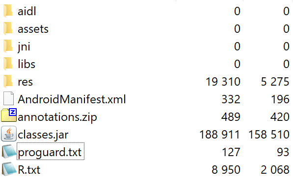

When starting a new project, all the Proguard configuration goes into that single proguard-rules.pro file. This is fine for the beginning or just simple apps, but gets unmaintainable when expanding to multiple modules.

#### Modular Proguard Configuration

Noticed that in current Android libraries you do not have to add any Proguard rules? That’s because the clever guys designing the Android Gradle plugin now support modular Proguard configurations (_I believe since v2_).

Even with local modules, push the rules to the respective module to keep Proguard contained, descriptive and maintainable. This has the main advantage that the configuration lifecycle follows the one of the module itself (e.g. when the module gets deleted all Proguard rules with it etc.)

Each dependency or module may package its own proguard.txt in the top level of it’s AAR package which will be appended to the main configuration.



Example of the file layout of an .aar file containing proguard.txt

This will be supported with the following Gradle property:

```
buildTypes {  
    release {  
        ...  
        consumerProguardFiles 'proguard-rules.pro'  
    }  
}
```

where the proguard-rules.pro files contain the rules specific to that module. If you wonder how the merged configuration file looks, just add the following to your current config:

```
**\-printconfiguration** proguard-merged-config.txt
```

Note however, to **use the most defensive rules possible**, leaving the main module the fine-tuning. For instance if a library adds the -dontoptimze flag in its configuration file, there is no way for the app to enable optimization again. The merging strategy does not seem to be as sophisticated as the e.g. [resource merger](https://developer.android.com/studio/write/add-resources.html#resource_merging), meaning you have no way to force certain rules over others.

#### Supporting Modular Proguard Config with Java Modules

Unfortunately the current Android Gradle plugin (_v3_) does not support consumer Proguard files. This is due to the AarTransformer reading the proguard.txt from the archive but the JarTransformer does not. Hopefully the Android build team will add this in the future.

In the meantime you could use the following workaround for your _local Java modules:_

Let’s say your module is called myJavaModule: Create a proguard-rules.pro file in the root as you would normally. Then just create a static link to it in your Proguard config in the app module:

```
buildTypes {  
    release {  
        ...  
        proguardFiles ... "$rootProject.rootDir.absolutePath/myJavaModule/proguard-rules.pro"  
    }  
}
```

This is not the most sophisticated workaround, but once the Android DSL will support jar files no more configuration is needed (apart from remove the static link)

### Summary

*   Use consumerProguardFiles property in the Android Gradle DSL to set module specific Proguard rules (especially as a library developer)
*   Be as defensive as possible with those rules, since the consumer most likely cannot override them.
*   Currently, there is no direct support for modular configurations with Java modules


