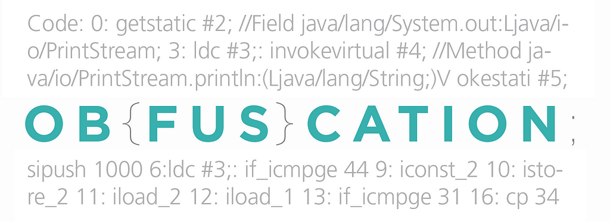
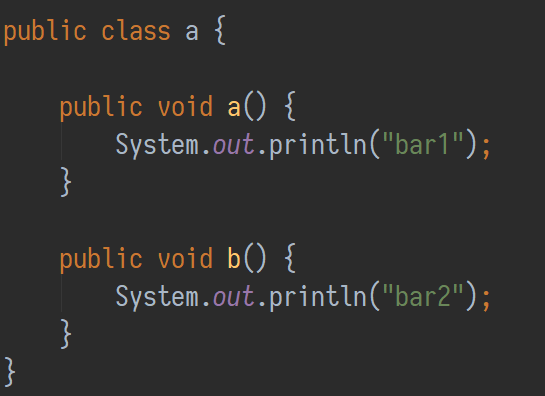

Inspired by [www.obfuscationworkshop.io](http://www.obfuscationworkshop.io)

_In this article I will show you how to strengthen ProGuard’s name obfuscation, making it harder for an attacker the reverse engineer your code and how this will help prevent many bugs created by incorrect obfuscation_

I‘ll tell you a secret: ProGuard is actually a code optimizer. One of the optimization’s side-effects just happen to add some name obfuscation to the resulting byte code, namely the shorting and reusing of class and method-names. The actually benefit being, that the resulting binary is smaller and better compressible (smaller binaries can be loaded faster into the heap, ie. reduce latency).

#### How does ProGuard’s Name Obfuscation work

ProGuard uses dictionaries to define to what to rename a package, class or method. There is a default dictionary which just contains the letters a-z.

Let’s consider the following code with this lonely class:


When optimizing with ProGuard, it will start by processing Foo.class. ProGuard will check it’s dictionary, the first entry being the letter a. There is no class with that name in this package, so this will result in Foo.class being renamed to a.class. Next the methods will be renamed: bar1() will turn into a() and bar2() into b() using the same strategy. A Java syntax representation of the resulting class would look like this:



Obfuscated version of class Foo

Now if you would add a new class Foobar.class it would be renamed to b.class and so on. If there are more then 26 classes in a package, the name gets longer: aa.class, ab.class, etc.

### Preventing Deterministic Name Obfuscation

The name obfuscation **process is deterministic**. There is a defined ordering (I guess it is just lexicographical) in which the class are processed, so Foo.class would still be a.class and the methods would still be a() and b() respectively after adding a second class. That does not mean it will never change. If a class is added, which ordered, is in the middle of other classes the obfuscation mapping _will_ change, but often than not the mapping stays similar over builds.

From a security standpoint this is not optimal. If an attacker knows that in version 1 of your app a.b() is e.g. your licence check logic, it will be easy to find that same logic in version 2 if it is still a.b().

#### Providing Custom Name Obfuscation Dictionary

ProGuard allows you to define the following dictionaries: (see the [official manual for more info](https://www.guardsquare.com/en/proguard/manual/usage#obfuscationoptions))

```
**\-obfuscationdictionary** method-dictionary.txt  
**\-packageobfuscationdictionary** package-dictionary.txt  
**\-classobfuscationdictionary** class-dictionary.txt
```

The format of which are [just a simple text file](https://stackoverflow.com/a/10046282/774398) with an entry each line, ignoring empty lines and lines starting with #

```
\# A custom method dictonary  
  
NUL  
CoM4  
COm9  
lpt2  
com5
```

It is possible to have a little fun with these files. For instance, in the [ProGuard distribution](https://sourceforge.net/projects/proguard/), there are some examples of alternative dictionaries. [This file contains names](https://github.com/facebook/proguard/blob/master/examples/dictionaries/windows.txt) which will make it impossible to extract the classes from the package (e.g .jar) in Windows because it would create illegal file names. Another version is optimized to enable the [best possible compression](https://github.com/facebook/proguard/blob/master/examples/dictionaries/compact.txt) by using common small keywords in the byte code format. Another option is to use [Java keywords as class and method names](https://github.com/facebook/proguard/blob/master/examples/dictionaries/keywords.txt) which is allowed in the byte code format creating very confusing stack traces.

Either way, this somewhat improves name obfuscation, but we still have the problem of it being fully deterministic.

#### Randomizing the Dictionary

[Eric Lafortune](https://stackoverflow.com/users/492694/eric-lafortune), the creator of ProGuard (and it’s commercial counter-part DexGuard) intended the obfuscation to be deterministic (see this [features request about randomization of the dictionary](https://sourceforge.net/p/proguard/feature-requests/111/)) but there is an easy trick to work around that: In our build tool, before executing ProGuard, we just generate a file with a random dictionary.

Using the Android Gradle build process as example, you could dynamically add a task which runs before ProGuard task itself:

```
tasks.whenTaskAdded { currentTask ->  
    //Android Gradle plugin may change this task name in the future  
    def prefix = 'transformClassesAndResourcesWithProguardFor'

    if (currentTask.name.startsWith(prefix)) {

        def taskName = currentTask.name.replace(prefix,  
                       'createProguardDictionariesFor')

        task "$taskName" {  
            doLast {  
                createRandomizedDictonaries()  
            }  
        }  
  
        //append scramble task to proguard task  
        currentTask.dependsOn "$taskName"  
    }  
}
```

Now in the task you would need to do the following:

*   Read a template file with all possible dictionary entries
*   Shuffle the entries; do not pick 100% of the entries but a random amount between e.g. 60–90% so mappings cannot be easily converted between builds
*   Write the entries to a file
*   Reference the file in your ProGuard with -obfuscationdictionary
*   Repeat the steps for the class dictionary -classobfuscationdictionary

#### Additional Features

Another feature I would suggest is the option to repackage all classes to a single package. This config would move all classes to a root-level package o

```
**\-repackageclasses** 'o'
```

This can also be set dynamically with a similar logic described as above.

For easier debugging you can print out the assembled ProGuard config (when using multiple config files) with

```
**\-printconfiguration** proguard-merge-config.txt
```

### Consequence of using Random Name Obfuscation

Be aware that each build variation _will have a practically unique obfuscation mapping_. So in an Android build, each [build variant](https://developer.android.com/studio/build/build-variants.html) (flavor or build type) will create very different stack traces. So be careful to _keep all the mappings_ for every version, flavor and build-type in Gradle and all [classifiers](https://maven.apache.org/pom.html#Dependencies) in Maven.

This isn’t a disadvantage though. One bug which many Android developers experience at least once: _persisting of obfuscated names which makes migration impossible_. This usually happens when a [Json databinding serializer](https://github.com/FasterXML/jackson-databind) is used, which reads class and method names through reflection and converts them, or by using \*.getClass().getName() is used with either SharedPreferences or Databases. The worst part is: this usually doesn’t get noticed because the name obfuscation mapping could stay the same for next couple of releases. So you are stuck with e.g.

```
{  
   "xf": {  
      "a": "Foo",  
      "ce": {  
          "tx": [{  
              "by": "Foobar",  
              "bv": 137  
          }]  
      }  
   }  
}
```

By forcing a different mapping each build, bugs like these will immediately surface, essentially _creating a_ [_fail-fast_](https://en.wikipedia.org/wiki/Fail-fast) _for ProGuard mappings_.

### Summary

*   ProGuard’s name obfuscation is _deterministic_, therefore when the code only changes a little the _mappings mostly stay the same_ over multiple releases
*   It is possible create _randomized dictionary_ for the obfuscation and tell ProGuard to use them, so every build will have a _unique mapping_, making it harder for an attacker to reverse engineer your code
*   Randomized name obfuscation also has the advantage of _acting as a fail-fast_ so common ProGuard configuration issues will

[ProGuard manual | Usage](https://www.guardsquare.com/en/proguard/manual/usage#obfuscationoptions)


