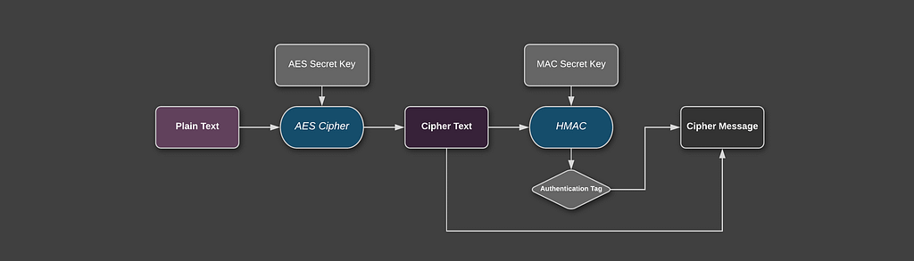

### Security Best Practices: Symmetric Encryption with AES in Java and Android: Part 2: AES-CBC + HMAC

_This is the follow-up to my previous article: “_[_Symmetric Encryption with AES in Java and Android_](https://proandroiddev.com/security-best-practices-symmetric-encryption-with-aes-in-java-7616beaaade9)_” where I summarize the most important facts about AES and show how to put it to use with AES-GCM. I highly recommend reading it before this one, because it explains the most important basics, before diving right into the next topic._

This article discusses the following scenario: what if you can’t use the [Advanced Encryption Standard (AES)](https://en.wikipedia.org/wiki/Advanced_Encryption_Standard) with authenticated encryption mode like the [Galois/Counter Mode (GCM)](https://en.wikipedia.org/wiki/Galois/Counter_Mode)? Either it is not supported on your currently used platform or you have to incorporate a legacy or third party protocol? [Whatever reason](https://security.stackexchange.com/questions/184305/why-would-i-ever-use-aes-256-cbc-if-aes-256-gcm-is-more-secure) you may have ditching GCM, you should not ditch the security properties it comes with:

*   **Confidentiality**: Nobody without the key can read the message
*   **Integrity:** Nobody has changed the content of the message
*   **Authenticity:** The originator of the message can be verified

Choosing a non-authenticated encryption, like the block mode [cipher block chaining](https://en.wikipedia.org/wiki/Block_cipher_mode_of_operation#Cipher_Block_Chaining_(CBC)) (CBC) by itself, will unfortunately lack the latter two properties since it is [malleable](https://crypto.stackexchange.com/questions/13264/why-is-cbc-based-on-aes-malleable-in-blocks-other-than-the-first-block). How to fix this? As stated in my previous article, a possible solution would be to combine cryptographic primitives to include a [message authentication code (MAC)](https://en.wikipedia.org/wiki/Message_authentication_code).

#### Message Authentication Code (MAC)

So what is a MAC, and why do we need it? A MAC is similar to a hash function, meaning it takes a message as input and generates a short so-called _tag_. To make sure not everybody can create a tag for any arbitrary message, the MAC function requires a secret key for its calculation. In contrast to a signature used with asymmetric encryption, a MAC has the same key for both generation and authentication.

For example if two parties securely exchanged MAC keys, and every message has an authentication tag attached, they both can check if the message was created by the other party and that it wasn’t changed during transmission. An attacker would need the secret MAC key to forge the authentication tag.

One of the most widely used types of MAC is the [keyed-hash message authentication code (HMAC)](https://en.wikipedia.org/wiki/HMAC) which incorporates a [cryptographic hash function](https://en.wikipedia.org/wiki/Cryptographic_hash_function), often SHA256. As I won’t get into detail of the algorithm, I’ll recommend reading the [RFC](https://tools.ietf.org/html/rfc2104). Other types are available which are based on symmetric ciphers, like [CBC-MAC](https://en.wikipedia.org/wiki/CBC-MAC). Nearly all crypto frameworks include at least a HMAC implementation, including the [JCA/JCE](https://docs.oracle.com/javase/7/docs/technotes/guides/security/crypto/CryptoSpec.html#Mac) through its [Mac](https://docs.oracle.com/javase/7/docs/api/javax/crypto/Mac.html) class.

#### Using a MAC with Encryption: Scheme

So what is the right way to apply this MAC? According to security researcher [Hugo Krawcyzk](https://researcher.watson.ibm.com/researcher/view.php?person=us-hugokraw) there are [basically three options](http://citeseerx.ist.psu.edu/viewdoc/download?doi=10.1.1.106.5488&rep=rep1&type=pdf):

*   **MAC-then-Encrypt**: MAC the plain-text and then append it before encrypting both (used in [SSL](http://tools.ietf.org/html/rfc5246#section-6.2.3))
*   **Encrypt-then-MAC**: MAC the cipher-text and initial vector then append it to the cipher-text (used in [IPsec](http://tools.ietf.org/html/rfc4303#section-3.3.2.1))
*   **Encrypt-and-MAC**: MAC the plain-text, encrypt and then append it to the cipher-text (used in [SSH](http://tools.ietf.org/html/rfc4253#section-6.4))

Every option has its own properties, and I’ll encourage you to read a full argument of [either option in this post](https://crypto.stackexchange.com/a/205/44838). To summarize, [most](https://crypto.stackexchange.com/a/224/44838) [researchers](https://moxie.org/blog/the-cryptographic-doom-principle/) [recommend](http://citeseerx.ist.psu.edu/viewdoc/download?doi=10.1.1.106.5488&rep=rep1&type=pdf) [Encrypt-then-MAC (EtM)](https://tools.ietf.org/html/rfc7366). It protects against chosen cipher-text attacks, since the MAC can prevent decryption of incorrect messages. Additionally, the MAC can’t leak information about the plain-text since it operates on the cipher-text. On the downside, it is slightly harder to implement since the IV and a possible protocol /algorithm version or type must be included in the tag. The important thing is to never do any cryptographic operation before verifying the MAC, otherwise you can be vulnerable to a [padding-oracle attack](https://en.wikipedia.org/wiki/Padding_oracle_attack) ([Moxie](https://en.wikipedia.org/wiki/Moxie_Marlinspike) calls this the [Doom Principle](https://moxie.org/blog/the-cryptographic-doom-principle/)).



Encrypt-then-Mac schema

**_Addendum: GCM vs. Encrypt-then-Mac_** Generally the security strength of using either is probably similar. GCM has some advantages:

*   Simple to use aka less to get wrong
*   Faster, as it only needs a single pass through the whole message

On the downside it only allows 96 bit initial vector (vs. 128 bit) and HMAC is theoretically stronger than GCM’s internal MAC algorithm GHASH (128 bit tag size vs. 256 bit+). GCM also fails miserably on [IV+Key reuse](https://crypto.stackexchange.com/questions/26790/how-bad-it-is-using-the-same-iv-twice-with-aes-gcm). For more detailed discussion [read here](https://crypto.stackexchange.com/a/10808/44838).

#### Using a MAC with Encryption: Authentication Key

The last issue we have to solve: where do we get the secret key for the MAC calculation? There seems to be [no known problem](https://crypto.stackexchange.com/a/8086/44838) when using the same key as for the encryption (when using HMAC) if the used secret key is strong (i.e. sufficiently random and securely exchanged). However, best practice is to use a key derivation function (KDF) to derive 2 sub-keys just to be on the “safe” side if any problems may be found in the future. This can be as simple as calculating a SHA256 on the main secret key and splitting it to two 16 byte blocks. However, I rather much prefer standardized protocols like the [HMAC-based Extract-and-Expand Key Derivation Function](https://tools.ietf.org/html/rfc5869) (HKDF) which directly support such use cases without byte fiddling.


Key derivation of the two sub-keys

### Implementing AES-CBC with EtM in Java and Android

Enough theory, let’s code! In the following examples I will use AES-CBC, a seemingly conservative decision. The reason for this is, it should be [guaranteed to be available on nearly every JRE](https://docs.oracle.com/javase/7/docs/api/javax/crypto/Cipher.html) and [Android version](https://developer.android.com/reference/javax/crypto/Cipher). As explained before we will be using the Encrypt-then-Mac scheme with HMAC. The only external dependency is [HKDF](https://github.com/patrickfav/hkdf). This code is basically a port of the example using GCM described in my [previous article](https://proandroiddev.com/security-best-practices-symmetric-encryption-with-aes-in-java-7616beaaade9).

#### Encryption

To keep it simple, we use a randomly generated 128-bit key. Java will automatically choose the correct mode when you pass a key with 128, 192 or 256 bit length. Note however, 256-bit encryption usually requires the [JCE Unlimited Strength Jurisdiction Policy](http://www.oracle.com/technetwork/java/javase/downloads/jce8-download-2133166.html) installed in your JRE (OpenJDK & Android is fine). If you are not sure what key size to use, read the passage about this topic in my [previous article](https://proandroiddev.com/security-best-practices-symmetric-encryption-with-aes-in-java-7616beaaade9).

```
SecureRandom secureRandom = new SecureRandom();  
byte[] key = new byte[_16_];  
secureRandom.nextBytes(key);
```

Then we have to create our initialization vector. For CBC a 16 byte long initial vector (IV) should be used. Be mindful to always use a strong [pseudorandom number generator (PRNG)](https://en.wikipedia.org/wiki/Pseudorandom_number_generator) like SecureRandom.

```
byte[] iv = new byte[_16_];  
secureRandom.nextBytes(iv);
```

Reusing an IV is not as catastrophic as with GCM, but should be avoided nevertheless. See a [possible attack here](https://stackoverflow.com/a/3008544/774398).

In the next step we will derive our 2 sub-keys needed for encryption and authentication. We will use [HKDF](https://tools.ietf.org/html/rfc5869) in the configuration HMAC-SHA256 ([with this library](https://github.com/patrickfav/hkdf)) since it is easy and straight forward to use. We generate two 16 byte sub keys using the info parameter in HKDF to differentiate between them.

```
// import at.favre.lib.crypto.HKDF;

byte[] encKey = HKDF.fromHmacSha256().expand(key, "encKey".getBytes(StandardCharsets._UTF_8_), 16);  
byte[] authKey = HKDF.fromHmacSha256().expand(key, "authKey".getBytes(StandardCharsets._UTF_8_), 32); //HMAC-SHA256 key is 32 byte
```

Next we will initialize the cipher and encrypt our plain-text. Since CBC is and behaves like a block mode we need a padding mode for messages which do not exactly fit the 16 byte block size. Since there seems to be [no security implication](https://crypto.stackexchange.com/questions/1486/how-to-choose-a-padding-mode-with-aes/1488#1488) regarding the used padding scheme, we chose the most widely supported: [PKCS#7](https://en.wikipedia.org/wiki/Padding_(cryptography)#PKCS%235_and_PKCS%237).

**_Note:_** due to [legacy reasons](https://crypto.stackexchange.com/questions/9043/what-is-the-difference-between-pkcs5-padding-and-pkcs7-padding), we have to set our cipher suite to PKCS5. Both are practically the same but defined for different block sizes; normally PKCS#5 would not be compatible with AES, but since the definitions date back to 3DES where 8 byte blocks were used, we are stuck with it. If your JCE provider accepts AES/CBC/PKCS7Padding it's better to use this definition, so your code is easier to understand.

```
final Cipher cipher = Cipher._getInstance_("AES/CBC/PKCS5Padding"); //actually uses PKCS#7  
cipher.init(Cipher._ENCRYPT_MODE_, new SecretKeySpec(encKey, "AES"), new IvParameterSpec(iv));  
byte[] cipherText = cipher.doFinal(plainText);
```

Next we have to prepare the MAC and add the main data to authenticate.

```
SecretKey macKey = new SecretKeySpec(authKey, "HmacSHA256_"_);  
Mac hmac = Mac._getInstance_("HmacSHA256_"_);  
hmac.init(macKey);  
hmac.update(iv);  
hmac.update(cipherText);
```

If you want to authenticate additional metadata, like the protocol version, you could also add it to the mac generation. This is the same concept as adding associated data to an [authenticated encryption algorithm](https://en.wikipedia.org/wiki/Authenticated_encryption#Authenticated_Encryption_with_Associated_Data).

```
if (associatedData != null) {  
    hmac.update(associatedData);  
}
```

Then calculate the mac.

```
byte[] mac = hmac.doFinal();
```

Finally, serialize all of it to a single message.

```
ByteBuffer byteBuffer = ByteBuffer._allocate_(1 + iv.length + 1 + mac.length + cipherText.length);  
byteBuffer.put((byte) iv.length);  
byteBuffer.put(iv);  
byteBuffer.put((byte) mac.length);  
byteBuffer.put(mac);  
byteBuffer.put(cipherText);  
byte[] cipherMessage = byteBuffer.array();
```

And that’s basically it for encryption. For constructing the message, the length of the IV, the IV, the length of the mac, the mac and the encrypted data are appended to a single byte array.

Optionally encode it with e.g. [Base64](https://en.wikipedia.org/wiki/Base64) if you require a string representation. [Android does have a standard implementation](https://developer.android.com/reference/android/util/Base64.html) of this encoding, the JDK only from [version 8 on](https://docs.oracle.com/javase/8/docs/api/java/util/Base64.html) (I would avoid [Apache Commons Codec](https://commons.apache.org/proper/commons-codec/apidocs/org/apache/commons/codec/binary/Base64.html) if possible since it is slow and a messy implementation).

It is [best practice to try to wipe sensible](https://security.stackexchange.com/questions/74280/would-it-be-good-secure-programming-practice-to-overwrite-a-sensitive-variable) data like a cryptographic key or IV from memory as fast as possible. Since Java is a language with [automatic memory management](https://en.wikipedia.org/wiki/Garbage_collection_(computer_science)), we don’t have any guarantees that the following works as intended, but it should in most cases:

```
Arrays.fill(authKey, (byte) 0);  
Arrays.fill(encKey, (byte) 0);
```

Be mindful to not overwrite data that is still used somewhere else.

#### Decryption

Decryption works similar to encryption in reverse: first deconstruct the message.

```
ByteBuffer byteBuffer = ByteBuffer._wrap_(cipherMessage);  
  
int ivLength = (byteBuffer.get());  
if (ivLength != 16) { // check input parameter  
    throw new IllegalArgumentException("invalid iv length");  
}

byte[] iv = new byte[ivLength];  
byteBuffer.get(iv);  
  
int macLength = (byteBuffer.get());  
if (macLength != 32) { // check input parameter  
    throw new IllegalArgumentException("invalid mac length");  
}

byte[] mac = new byte[macLength];  
byteBuffer.get(mac);  
  
byte[] cipherText = new byte[byteBuffer.remaining()];  
byteBuffer.get(cipherText);
```

Be careful to [validate input parameters](https://cwe.mitre.org/data/definitions/789.html) to prevent denial of service attacks, like the IV or mac length, as an attacker may change the value.

Then derive the keys needed for decryption and authentication.

```
// import at.favre.lib.crypto.HKDF;

byte[] encKey = HKDF.fromHmacSha256().expand(key, "encKey".getBytes(StandardCharsets._UTF_8_), 16);  
byte[] authKey = HKDF.fromHmacSha256().expand(key, "authKey".getBytes(StandardCharsets._UTF_8_), 32);
```

**Before** we decrypt anything, we will verify the MAC. First we calculate the MAC as before; don’t forget previously added associated data.

```
SecretKey macKey = new SecretKeySpec(authKey, "HmacSHA256_"_);  
Mac hmac = Mac._getInstance_("HmacSHA256_"_);  
hmac.init(macKey);  
hmac.update(iv);  
hmac.update(cipherText);  
if (associatedData != null) {  
    hmac.update(associatedData);  
}  
byte[] refMac = hmac.doFinal();
```

Now when comparing the mac, we need a constant time comparing function to avoid [side channel attacks](https://en.wikipedia.org/wiki/Side-channel_attack); [read here why this is important](https://codahale.com/a-lesson-in-timing-attacks/). Luckily we can use [MessageDigest.isEquals()](https://docs.oracle.com/javase/7/docs/api/java/security/MessageDigest.html#isEqual(byte[],%20byte[])) (the old bug was fixed in [Java 6u17](https://www.oracle.com/technetwork/java/javase/6u17-141447.html)):

```
if (!MessageDigest.isEqual(refMac, mac)) {  
    throw new SecurityException("could not authenticate");  
}
```

As the last step we can finally decrypt our message.

```
final Cipher cipher = Cipher._getInstance_("AES/CBC/PKCS5Padding");  
cipher.init(Cipher._DECRYPT_MODE_, new SecretKeySpec(encKey, "AES"), new IvParameterSpec(iv));  
byte[] plainText = cipher.doFinal(cipherText);
```

That’s it! If you like to see a full example check out my [GitHub project Armadillo](https://github.com/patrickfav/armadillo?utm_source=android-arsenal.com&utm_medium=referral&utm_campaign=6636) where [I use AES-CBC](https://github.com/patrickfav/armadillo/blob/master/armadillo/src/main/java/at/favre/lib/armadillo/AesCbcEncryption.java). You can also find this exact [example as Gist](https://gist.github.com/patrickfav/b323f0d9cbd81d5fa9cc4c971b732c77) if you have trouble following the snippets.

### Summary

We showed that the usage of AES with cipher block chaining (CBC) and Encrypt-then-MAC schema using HMAC provides all desirable security properties we would like to see from our encryption protocol:

> **Confidentiality, integrity and authenticity**

As can be seen, the protocol is a bit more involved as just using GCM. However, these primitives are generally available in all Java/Android environments, so it may be the only option you have. Just consider the following:

*   Use a 16 byte random initialization vector (use a strong [PRNG](https://en.wikipedia.org/wiki/Pseudorandom_number_generator))
*   Use 128+ bit MAC length (HMAC-SHA256 outputs 256 bit)
*   Use Encrypt-then-Mac
*   Use a KDF to derive the 2 Sub-Keys
*   Verify before decryption ([Doom Principle](https://moxie.org/blog/the-cryptographic-doom-principle/))
*   Prevent timing attacks by using constant time equals implementations
*   Use 128-bit encryption key length (you will be fine!)
*   Pack everything together into a single message

#### References

*   [patrickfav/hkdf](https://github.com/patrickfav/hkdf)
*   [patrickfav/armadillo](https://github.com/patrickfav/armadillo)

#### Further Reading

[Security Best Practices: Symmetric Encryption with AES in Java and Android](https://proandroiddev.com/security-best-practices-symmetric-encryption-with-aes-in-java-7616beaaade9)


