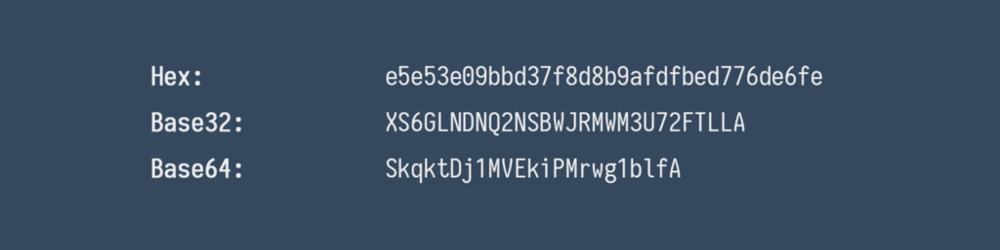

### **A Better Way to Protect Your IDs**

Your web application has a strong way of authentication and every resource has checks if your user is actual authorized to access it. So why bother if the user actual knows the internal IDs for the models she is accessing?

#### Issue #1: Leak of Business Intelligence Data

Your IDs might expose more information than you might realize. For instance in a web shop when you make an order you will probably be redirected to a success site with your order\_id found as a query parameter (or similar):

```
 https://www.myshop.com/account/orders?orderid=7865
```

From this you can probably estimate how many orders they processed. But it gets worse. If you make another other one, lets say 14 days later and it gets the id 7921 you can deduce that they receive about 4 orders a day. This is business intelligence data you maybe don’t want your competition to know (see also this [article](https://medium.com/lightrail/prevent-business-intelligence-leaks-by-using-uuids-instead-of-database-ids-on-urls-and-in-apis-17f15669fd2e) for a more thorough discussion on this issue).

#### Issue #2: Brute Force Guessing of IDs

Often resources are public, but are protected by the fact that nobody knows the correct identifier. Think about a naive photo sharing site where you can make a single photo accessible via a link:

```
https://www.myphotos.com/p/share?id=10989927
```

Now this id might be totally random, or it might follow a sequence. An attacker could easily check a reasonable interval from e.g. 10989900 to 10990000 and see if any of these links work.

#### Issue #3: **Leak of Personal Information Through IDs**

Sometimes you are required to share your user IDs with a statistics tool or other external service. If this ID is your primary key in the db and used as id in the shop it can probably be used on other parts of the site as an user\_id parameter and might leak personal information. Think about a message board where users usually have a public profile.

### What can be done?

#### Solution #1: Using UUIDs

A simple solution which tackles most of the issues is to not use _a_ sequence in a _small numeric range_ (i.e. a 64-bit integer) but to use a random value of a _big numeric range_. An implementation of such a concept is the universally unique identifier or [UUID](https://en.wikipedia.org/wiki/Universally_unique_identifier). Version 4 is based on random numbers and the one you want to use. Due to having some metadata it cannot use all of the 128-bit data, but is limited to 122-bit (which does not make a big difference in real world applications). There is no standardized text representation, but it is usually formatted as something like this:


Example UUID

The range of 122-bit is so huge, you can pick any such number randomly and have a nearly 100% chance of it being unique in your context. _In fact you are probably the first person to every generate this exact number._ Note though that a UUID does not give guarantees whatsoever of it being truly random — most implementation are however. See [this post](https://stackoverflow.com/a/44227131/774398) for more info on the issue.

It is now absolutely [infeasible](https://security.stackexchange.com/questions/6141/amount-of-simple-operations-that-is-safely-out-of-reach-for-all-humanity/6149#6149) for an attacker to guess your ids (but guessing _is_ theoretically still possible) and if the UUIDs are truly random, there is no observing a sequence (fixes _Issue #1 and #2_).

The downside of using UUIDs is that it is maybe slower or more expensive to index in your DB if you use it as primary key and might be a hassle to create a new column if you use it as correlation id. [Read here](https://tomharrisonjr.com/uuid-or-guid-as-primary-keys-be-careful-7b2aa3dcb439) for more in-depth discussion about UUIDs used in databases.

Also you still expose an internal id to the public, which if used as primary key, cannot change. This requirement might not happen often, [but it does](https://stackoverflow.com/q/3838414/774398). You may also still be prone to _Issue #3_.

#### Solution #2: Mask your IDs

The idea is not new, in fact there is a very popular set of libraries called [_HashIds_](https://hashids.org/) which tries to tackle this exact issue. The basic principle is this:

> Before publishing your IDs, encode or encrypt them in a way that makes the underlying value incomprehensible for any client not knowing the secret key.

In my opinion HashIds has, among others, two main issues:

*   Only supports integer types and restricted by limitations set by the original Javascript implementation (e.g. only positive integers up to 2⁵³ bit).
*   No real security, more like a home-brew keyed encoding schema and no forgery protection which means an attacker can still easily brute force IDs without understanding them.

### Improved ID Protection: ID-Mask

Unsatisfied with these properties I tried to create an improved version which tackles these and other issues called **ID-Mask** with a [reference implementation in Java](https://github.com/patrickfav/id-mask). The basic features are:

1.  Support of all types usually used for IDs
2.  Strong cryptography with forgery protection
3.  Optional randomized IDs

Note that with this (and HashIds) approach, _there is no possibility of collision_ since no compression happens (like with a hash).

#### Full Type-Support for IDs

If you think about it, there are only a handful of common types used as identifier:

*   64-bit integers (often called [long](https://docs.oracle.com/javase/7/docs/api/java/lang/Long.html))
*   [UUIDs](https://docs.oracle.com/javase/7/docs/api/java/util/UUID.html)(which are essentially 128-bit numbers)
*   Arbitrary precision integers (called [BigInteger](https://docs.oracle.com/javase/7/docs/api/java/math/BigInteger.html) in Java)

If we somewhat restrict the arbitrary precision part to around 128 bit, we can group into two basic id types: 64 bit and 128 bit IDs. All of those data types (and [some more exotic types](https://github.com/patrickfav/id-mask#step-2-choosing-the-correct-type) for specific uses cases) are supported by the library.

#### Strong Cryptography with Forgery Protection

Instead of encoding the ID with a shuffled alphabet, we can just use proven cryptography with the [Advanced Encryption Standard](https://en.wikipedia.org/wiki/Advanced_Encryption_Standard) (AES) and a [hash-based message authentication code](https://en.wikipedia.org/wiki/HMAC) (HMAC), the later of which protects the IDs from being altered by an attacker. All the caller needs to provide is a strong secret key. Fortunately since the key-id is encoded in the ID, the secret key can be changed if it gets compromised. There is a slight difference in the scheme for 64-bit based and 128 bit IDs to optimize for output size. For the interested reader, here is the [full explanation of the schema](https://github.com/patrickfav/id-mask#encryption-schema). There is also a [discussion on crypto.stackexchange.com](https://crypto.stackexchange.com/q/68415/44838)

In addition of solving the main _Issue #1_, these properties also protect from the attack described in _Issue #2: brute forcing._ With an so called _authentication tag_ (i.e. the HMAC) attached to the id, it is now extremely unlikely for an attacker to generate a valid ID.

#### Support for Randomized IDs

With IDs for domain models it makes sense that these are deterministic (i.e. do not change for the same model over time) so that the client can check for equality for example for caching. However some use cases benefit from IDs that generate randomly looking output to make it hard for an attacker to compare or replicate IDs.

An example would be shareable links. Using the same scenario as above, of the photo sharing app, instead of the actual value it would just look like this:

```
https://www.myphotos.com/p/share?id=U1P72UtA6uS6ddMcTmzdKJg
```

Using the same id, generating 2 more masked IDs will result in unrelated looking output:

```
https://www.myphotos.com/p/share?id=aGjTc5AQQlWl8REodDmAM1c  
https://www.myphotos.com/p/share?id=bGx6LykZ0N_B2WpoT-1XbHg
```

Using this method the problem described in _Issue #3: leak of personal information_ can be solved by generating randomized IDs for e.g. your user\_id which cannot be used to find context information in e.g. your main site since they do not match. You are however still able to map the ids back to the original users.

#### Adapt the Encoding to Your Needs

The reference implementation supports a wide array of encodings which may be chosen due to various requirements (_short IDs_ vs. _readability_ vs. _should not contain words_), all of them being _url-safe_ of course.

Example using a 64-bit IDs:



with optional formatting for better readability:


Formatted ID

To avoid the problem of **randomly occurring (englisch) words** in the masked IDs which could create embarrassing URLs like

```
https://www.myportfolio.com/p?id=SH4RTM4N
```

a Base32 dialect was added with a custom alphabet containing **no vowels** and **other problematic letters** and numbers. For example these could look like this:


Encoding optimized to not contain words

#### And More

Currently the reference implementation is quite fast with around 2–8µs per ID encryption. There is a built-in cache to improve performance for frequently recurring IDs. Additionally there are default implementations for Java Jackson Json [Serializer](https://fasterxml.github.io/jackson-databind/javadoc/2.2.0/com/fasterxml/jackson/databind/JsonSerializer.html) and JAX-RS [ParamConverter](https://docs.oracle.com/javaee/7/api/javax/ws/rs/ext/ParamConverter.html).

#### Code Example

Here is a simple example using a 64-bit ID:

<a href="https://medium.com/media/2999846dec24fede05c7d05af52a674a/href">https://medium.com/media/2999846dec24fede05c7d05af52a674a/href</a>

For more see the readme of the [Github project](https://github.com/patrickfav/id-mask).

### tl;dr

There are many reasons why you may want to protect your internal IDs, either because they **leak business intelligence**, allow for **brute forcing** to find hidden content and may leak context of **personal information.** A possible solution is to use an additional ID column in your DB using **UUIDs** which solves many, but not all of the issues and **may not be feasible** with millions of data-sets. Another option is to **encrypt your IDs** to protect their value. There is a set of libraries called **HashIds** which tries to use this approach but currently has some major issues. I implemented a new approach, called **ID-Mask**, with a reference implementation in Java which supports **wide variety of data types** usually used as IDs, **strong cryptography** and also supports generation **randomized IDs**. The library is ready to use and can be [found on Github](https://github.com/patrickfav/id-mask).

[patrickfav/id-mask](https://github.com/patrickfav/id-mask)


