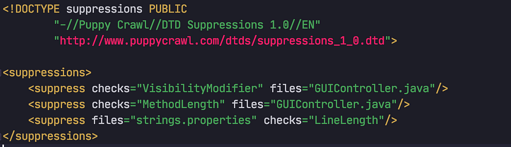

Checkstyle, loved by those who set it up, hated by those who didn’t, is Javas most popular tool to force your code style flavor onto others. Whatever your feelings about this static analyzer may be, if you have to manage it in your project(s) this article is for you.


A familiar sight for Checkstyle users

The default setup is quite easy. Create your checkstyle.xml add the rules you prefer and reference it in your Checkstyle Maven plugin. This may be fine for a single project, managing more would require copying the configuration file over and manually syncing them. Since most developers nowadays can’t escape the ubiquitous micro-services style architecture, where the myriads of services are managed either in a [monorepo](https://medium.com/@mattklein123/monorepos-please-dont-e9a279be011b) or in multiple individual ones, the latter needs a better solution for this problem.

### Maven to the Rescue

Of course there is a direct solution for this in your favorite build management system (which is, of course, Maven)! The required steps are as follows:

1.  Create a new Maven project only containing your checkstyle.xml
2.  Reference it in the Checkstyle Maven plugin of your consumer project
3.  Make your project deployable to publish it to your maven repo

Done!

#### 1\. Create a Project for your Checkstyle Config

Create a new project with your [preferred method](http://maven.apache.org/archetypes/maven-archetype-simple/). We name our configuration file checkstyle.xml and put it into /src/main/resource.


As test configuration I used this unbearable annoying line length restriction (which helps to see if it works later):

```
<?xml version="1.0" ?><!DOCTYPE module PUBLIC  
        "-//Puppy Crawl//DTD Check Configuration 1.2//EN"  
        "http://www.puppycrawl.com/dtds/configuration_1_2.dtd">  
  
<module name="Checker">  
    <module name="LineLength">  
        <property name="max" value="25"/>  
    </module>  
</module>
```

Now all you have to do is to install it to your local repo with:

```
mvn clean install
```

#### 2\. Reference it in your Consumer Project

Find the Checkstyle Plugin in your consumer POM and add your newly create config project as dependency. This may look like this:

```
<plugin>  
    <groupId>org.apache.maven.plugins</groupId>  
    <artifactId>maven-checkstyle-plugin</artifactId>  
    <dependencies>  
        <dependency>  
            <groupId>com.puppycrawl.tools</groupId>  
            <artifactId>checkstyle</artifactId>  
            <version>8.31</version>  
        </dependency>  
        **<dependency>  
            <groupId>com.company.projectname</groupId>  
            <artifactId>checkstyle-config</artifactId>  
            <version>1</version>  
        </dependency>**  
    </dependencies>  
    <configuration>  
        <configLocation>**checkstyle.xml**</configLocation>  
    </configuration>  
</plugin>
```

The filename used in configLocation must match the filename used in your _checkstyle-config_ project. Don’t forget to delete your local Checkstyle configuration file. Now if you do:

```
mvn checkstyle:check
```

it should use the config from your config project.

#### 3\. Make your Config Project Deployable

Some Maven repositories, like [Maven Central](https://search.maven.org/), require a sources and javadoc -jar if you want to deploy them there. Since there is neither source code, nor javadoc we have to create placeholders. In our _checkstyle-config_ project add the plugin config for the source code:

```
<plugin>  
    <groupId>org.apache.maven.plugins</groupId>  
    <artifactId>maven-source-plugin</artifactId>  
    <executions>  
        <execution>  
            <id>attach-sources</id>  
            <goals>  
                 <goal>jar-no-fork</goal>  
            </goals>  
        </execution>  
    </executions>  
</plugin>
```

then for the javadoc

```
<plugin>  
    <groupId>org.apache.maven.plugins</groupId>  
    <artifactId>maven-jar-plugin</artifactId>  
    <executions>  
        <execution>  
            <id>empty-javadoc-jar</id>  
            <phase>package</phase>  
            <goals>  
                <goal>jar</goal>  
            </goals>  
            <configuration>  
                <classifier>javadoc</classifier>  
                <classesDirectory>${basedir}/javadoc</classesDirectory>  
            </configuration>  
        </execution>  
    </executions>  
</plugin>
```

Now after setting the correct coordinates for the distribution management, you should be able to deploy and publish your configuration project with

```
mvn deploy
```

A full example, deployed to Maven Central, can be found here

[patrickfav/checkstyle-config](https://github.com/patrickfav/checkstyle-config/)

### How to use Suppressions

While it is possible to also package a checkstyle-suppression.xml in the same way as described above, I do not think a global suppression file makes a whole lot of sense.



It is, however, possible to set one locally, in basically the same way you would normally. Create your suppression config in your project and reference it in your Checkstyle plugin configuration. In this example we name the file checkstyle-suppression.xml and put it into the project’s root folder. Then we add the reference in the POM:

```
<plugin>  
    <groupId>org.apache.maven.plugins</groupId>  
    <artifactId>maven-checkstyle-plugin</artifactId>  
    ...  
    <configuration>  
        <configLocation>checkstyle.xml</configLocation>  
        <suppressionsLocation>checkstyle-suppressions.xml</suppressionsLocation>  
    </configuration>  
</plugin>
```

An example using suppressions with a global _checkstyle-config_ can be found [here](https://github.com/patrickfav/density-converter) (Checkstyle config is found in parent POM).

### Keep using your IDE Checkstyle Plugin

If you use the excellent [Checkstyle IntelliJ plugin](https://plugins.jetbrains.com/plugin/1065-checkstyle-idea) (or a similar tool), you may wonder where the local configuration can be found. After you mvn install it will be located at /target/checkstyle-checker.xml.


### Summary

We’ve created a separate Maven project to put a global Checkstyle configuration in it for easier distribution among other projects. We adjusted this project to be able to deploy it to Maven repositories with stricter rules, like Maven Central. We then discussed how to handle suppressions and local Checkstyle plugins.

#### Sources

*   [How to upload an artifact to Maven Central with an empty javadoc jar (or empty sources jar), because of no Java code nor resources?](https://stackoverflow.com/a/53707024/774398)
*   [how to externalise the checkstyle config for maven-checkstyle-plugin](https://stackoverflow.com/questions/19682455/how-to-externalise-the-checkstyle-config-for-maven-checkstyle-plugin/19690484#19690484)


