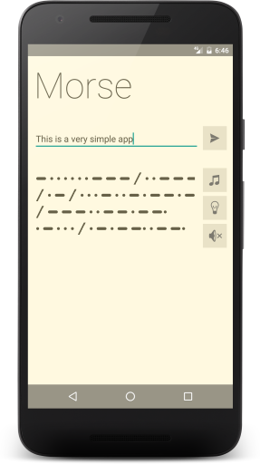
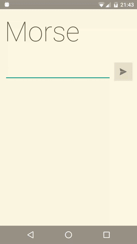

# Morseme

A very simple Android app that can morse given input through audio, vibration and light flash.
It also has the feature to morse (with vibrate) a SMS you receive if the SMS starts with "morse:",
so you could receive messages without anybody noticing. Of course, nobody can really read/feel
morse this does not have any practical purpose of course :)

It is not considered release-ready, it was just a fun little project. Enjoy
and use at your own risk.

# License

Copyright 2014 Patrick Favre-Bulle

Licensed under the Apache License, Version 2.0 (the "License");
you may not use this file except in compliance with the License.
You may obtain a copy of the License at

    http://www.apache.org/licenses/LICENSE-2.0

Unless required by applicable law or agreed to in writing, software
distributed under the License is distributed on an "AS IS" BASIS,
WITHOUT WARRANTIES OR CONDITIONS OF ANY KIND, either express or implied.
See the License for the specific language governing permissions and
limitations under the License.
