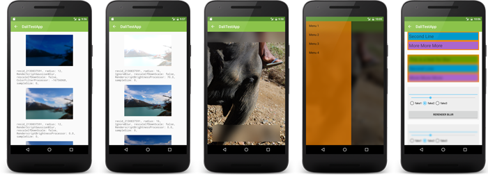
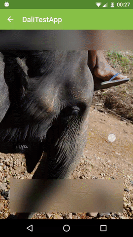
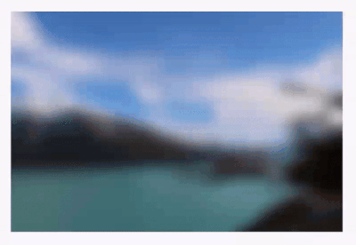

# Dali

Dali is an image blur library for Android. It is easy to use, fast and extensible.
Dali contains several modules for either static blurring, live blurring and animations.
It uses RenderScript internally (although different implementations can be chosen) and is heavily
cached to be fast and keeps small memory footprint. It features a lot of additional image filters and may be
easily extended and pretty every configuration can be changed.

[](https://mvnrepository.com/artifact/at.favre.lib/dali)
[](https://travis-ci.com/patrickfav/Dali)
[](https://www.javadoc.io/doc/at.favre.lib/dali)
[](https://android-arsenal.com/details/1/5130)
[](https://codeclimate.com/github/patrickfav/Dali/maintainability)




*Note: This library is in prototype state and not ready for prime time. It is mostly feature complete (except for the animation module) although bugs are to be expected.*

# Install

Add the following to your dependencies  ([add jcenter to your repositories](https://developer.android.com/studio/build/index.html#top-level) if you haven't)

```groovy
   dependencies {
        compile 'at.favre.lib:dali:0.4.0'
   }
```

Then add the following to your app's build.gradle to get Renderscript to work

```groovy
android {
    ...
    defaultConfig {
        ...
        renderscriptTargetApi 24
        renderscriptSupportModeEnabled true
    }
}
```
The quickest way to discover possible features, is to see what builder methods `Dali.create(context)` contains.

## Download Test App

[](https://play.google.com/store/apps/details?id=at.favre.app.dalitest&pcampaignid=MKT-Other-global-all-co-prtnr-py-PartBadge-Mar2515-1)

The test app is in the Playstore, you can get it here [Dali Test App](https://play.google.com/store/apps/details?id=at.favre.app.dalitest).

# Features

## Static Blur

Static blur refers to blurring images that do not change dynamically in the UI (e.g. a static background image).
Dali uses the builder pattern for easy and readable configuration. A very simple example would be:
```java
    Dali.create(context).load(R.drawable.test_img1).blurRadius(12).into(imageView);
```
which would blur given image in a background thread and set it to the `ImageView`. Dali also supports additional
image manipulation filters i.e. brightness, contrast and color.

Most of them use RenderScript so they should be reasonably fast, although check compatibility.
For details on the filter implementation see the `at.favre.lib.dali.builder.processor` package.

Any other manipulation filter can be implemented through the `IBitmapProcessor` and `.addPreProcessor`
on a builder.

A more complex example including filters would be:
```java
    Dali.create(context).load(R.drawable.test_img1).placeholder(R.drawable.test_img1).blurRadius(12)
        .downScale(2).colorFilter(Color.parseColor("#ffccdceb")).concurrent().reScale().into(iv3)
```
This will blur, color filter a downscaled version of given image on a concurrent thread pool and rescales it
the target (the imageView) this case and will set a placeholder until the operations are finished.

_Do note that `Dali.create(context)` will always create a new instance, so it may be advisable to keep the reference._

For more examples, see `SimpleBlurFragment.java` and `SimpleBlurBrightnessFragment.java`

### Blur any View

Apart from resource ids, bitmaps, files and InputStreams `.load(anyAndroidView)` method also loads any View as source
and blurs its drawingCache into the target view.
```java
   		Dali.create(context).load(rootView.findViewById(R.id.blurTemplateView)).blurRadius(20)
   		    .downScale(2).concurrent().reScale().skipCache().into(imageView);
```
For more examples, see `ViewBlurFragment.java`

### Skip blurring

If you want to utilize Dali's features, without blurring the image you could do:
```java
    Dali.create(context).load(R.drawable.test_img1).algorithm(EBlurAlgorithm.NONE).brightness(70).concurrent().into(iv);
```

## Live Blur

Live blur refers to an effect where it a portion of the view blurs what's behind it. It can be used with e.g.
a `ViewPager`, `Scrollview`, `RecyclerView`, etc.



A very simple example with a ViewPager would be:
```java
    blurWorker = Dali.create(getActivity()).liveBlur(rootViewPagerWrapperView,topBlurView,bottomBlurView).downScale(8).assemble(true);

    mViewPager.addOnPageChangeListener(new ViewPager.OnPageChangeListener() {
        @Override
        public void onPageScrolled(int position, float positionOffset, int positionOffsetPixels) {
            blurWorker.updateBlurView();
        }
        @Override public void onPageSelected(int position) {}
		@Override public void onPageScrollStateChanged(int state) {}
    });
```
A full example can be found in the test app's `LiveBlurFragment.java`

The idea is basically to hook up to the scrollable view and every scroll event the blur has to be updated with
`blurWorker.updateBlurView()`. Many of the views do not offer these features, therefore there are simple implementations
for some views (see package `at.favre.lib.dali.view.Observable*`)


## Navigation Drawer Background Blur

A specialized version of live blur is blurring the background of a `NavigationDrawer`:


```java
    protected void onCreate(Bundle savedInstanceState) {
        ...
		mDrawerToggle = new DaliBlurDrawerToggle(this, mDrawerLayout,
                toolbar, R.string.drawer_open, R.string.drawer_close) {

			public void onDrawerClosed(View view) {
				super.onDrawerClosed(view);
				invalidateOptionsMenu(); // creates call to onPrepareOptionsMenu()
			}

			public void onDrawerOpened(View drawerView) {
				super.onDrawerOpened(drawerView);
				invalidateOptionsMenu(); // creates call to onPrepareOptionsMenu()
			}
		};
		mDrawerToggle.setDrawerIndicatorEnabled(true);
		// Set the drawer toggle as the DrawerListener
		mDrawerLayout.addDrawerListener(mDrawerToggle);
        ...
	}

	@Override
	protected void onPostCreate(Bundle savedInstanceState) {
		super.onPostCreate(savedInstanceState);
		mDrawerToggle.syncState();
	}

	@Override
	public void onConfigurationChanged(Configuration newConfig) {
		super.onConfigurationChanged(newConfig);
		mDrawerToggle.onConfigurationChanged(newConfig);
	}

	@Override
	public boolean onPrepareOptionsMenu(Menu menu) {
		boolean drawerOpen = mDrawerLayout.isDrawerOpen(mDrawerList);
		return super.onPrepareOptionsMenu(menu);
	}
```

A full example can be found in the test app's `NavigationDrawerActivity.java`

## Blur Transition Animation

A simple framework for animating a static image from sharp to blur. It uses a keyframes to configure
the animation:
```java
    BlurKeyFrameManager man = new BlurKeyFrameManager();
    man.addKeyFrame(new BlurKeyFrame(2,4,0,300));
    man.addKeyFrame(new BlurKeyFrame(2,8,0,300));
    ...
```
then an `ImageView` can be animated:
```java
    BlurKeyFrameTransitionAnimation animation = new BlurKeyFrameTransitionAnimation(getActivity(),man);
    animation.start(imageView);
```


A full example can be found in the test app's `SimpleAnimationFragment.java`

The idea is from Roman Nurik's App Muzei where he explains how he does the blur transition smoothly and fast.
Instead of just alpha fading the source and the final blur image he creates different keyframes with various
states of blur and then fades through all those keyframes. This is a compromise between performance and image
quality.
[See his Google+ blog post for more info.](https://plus.google.com/+RomanNurik/posts/2sTQ1X2Cb2Z)

_Note: This module is not feature complete and has still terrible bugs, so use at your own risk._

## Proguard

Since v0.3.1 the lib includes it's own proguard consumer rules and should
work out of the box with obfuscated builds.

## Advanced

### How to build

Assemble the lib with the following command line call:

    gradlew :dali:assemble

The .aar files can be found in the `/dali/build/outputs/aar` folder

### Caching

## TODO

* fix animations
* add tests

# License

Copyright 2016 Patrick Favre-Bulle

Licensed under the Apache License, Version 2.0 (the "License");
you may not use this file except in compliance with the License.
You may obtain a copy of the License at

    http://www.apache.org/licenses/LICENSE-2.0

Unless required by applicable law or agreed to in writing, software
distributed under the License is distributed on an "AS IS" BASIS,
WITHOUT WARRANTIES OR CONDITIONS OF ANY KIND, either express or implied.
See the License for the specific language governing permissions and
limitations under the License.

