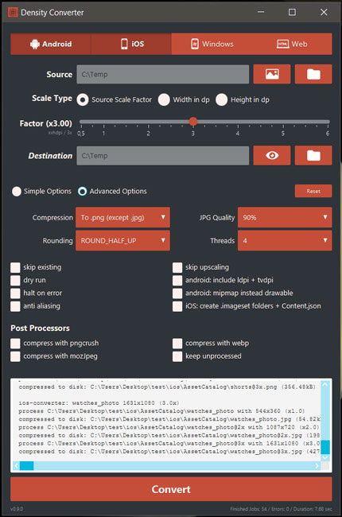
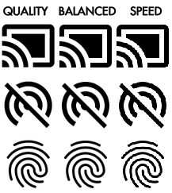
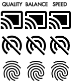
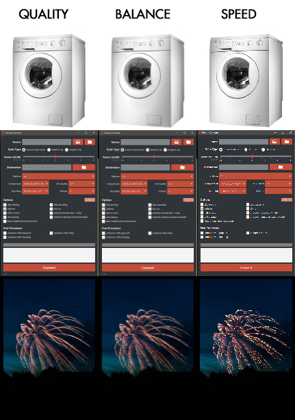
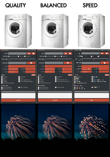
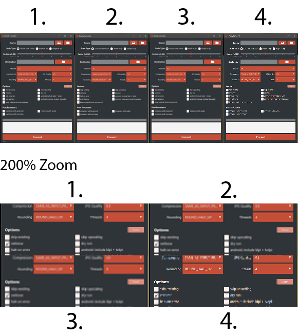

#  Density Image Converter Tool for Android, iOS, Windows and CSS

This is a powerful little tool that helps **converting single or batches of images** to **Android**, **iOS**, **Windows** and **CSS** specific formats and density
versions given the source scale factor or target width/height in [dp](http://developer.android.com/guide/practices/screens_support.html#density-independence).
It has a **graphical** and **command line** interface and supports a wide array of image types for reading and conversion
including PNG, JPEG, SVG, PSD and Android 9-patches. Using sophisticated scaling algorithms, it is designed to make conversion of images easy and
fast while keeping the image quality high (comparable to PS). To further optimize the output post processors like **pngcrush** and **mozJpeg** can be used (see section below).

[](https://github.com/patrickfav/density-converter/releases/latest)
[](https://travis-ci.com/patrickfav/density-converter)
[](https://coveralls.io/github/patrickfav/density-converter?branch=master) [](https://codeclimate.com/github/patrickfav/density-converter/maintainability)

Usage:

```
java -jar ./dconvert.jar -src "C:/your-folder/image-folder" -scale 4
```

while

```
java -jar ./dconvert.jar
```

will start the UI (_or double click the jar file_).

_To use the post processor ([pngcrush](http://pmt.sourceforge.net/pngcrush/), [mozJpeg](http://mozjpeg.codelove.de/binaries.html) and [webp](https://developers.google.com/speed/webp/download)) the respective cmd tool must be set in PATH._


## Download

**[Grab jar from latest release.](https://github.com/patrickfav/density-converter/releases/latest)**

### Requirements

* JDK 11

# Usage

## GUI

Start with

```
java -jar ./dconvert.jar
```

provides the same features as the command line tool so see the help page of command line or tooltips. Additionally the UI
will save its settings persistently making it easier for power users.



## Command Line

E.g. with `xxxhdpi` (x4) source files:

```
java -jar ./dconvert.jar -src "C:/master-image/ic_my_icon.png" -scale 4 -platform android
```

Will generate `mdpi`, `hdpi`, etc. folders in "C:/master-image/" containing the resized images

Full list of arguments:

    -androidIncludeLdpiTvdpi              Android only: creates mipmap sub-folders instead of drawable.
    -androidMipmapInsteadOfDrawable       Android only: If set will include additional densities (ldpi and
                                          tvdpi)
    -antiAliasing                         Anti-aliases images creating a little more blurred result; a light
                                          3x3 convolve matrix is used; useful for very small images
    -clean                                Deletes all file and folders in out dir that would be used in
                                          current configuration before converting.
    -compressionQuality <0.0-1.0>         Only used with compression 'jpg' sets the quality [0-1.0] where 1.0
                                          is the highest quality. Default is 0.9
    -dryRun                               Will not create any images or folder. Useful as fast preview in log
                                          what images in what resolutions would be created.
    -dst <path>                           The directory in which the converted files will be written. Will use
                                          the source folder if this argument is omitted.
    -gui                                  Starts graphical user interface
    -h,--help                             This help page
    -haltOnError                          If set will stop the process if an error occurred during conversion
    -iosCreateImagesetFolders             iOS only: Will create .imageset folders and Content.json for every
                                          source image n iOS converter. Default is just all images in the root
                                          folder.
    -keepOriginalPostProcessedFiles       If a post processor is run on a file, this flag will ensure that the
                                          original will be kept (renamed _orig), otherwise only the optimized
                                          image will be kept
    -outCompression <png|jpg|gif|bmp>     Sets the compression of the converted images. Can be 'png', 'jpg',
                                          'gif', 'bmp', 'png+jpg' or 'strict' which tries to use same
                                          compression as source. By default will convert to png except if
                                          source compression is jpeg.
    -platform <all|android|ios|win|web>   Can be 'all', 'android', 'ios', 'win' or 'web'. Sets what formats
                                          the converted images will be generated for. E.g. set 'android' if
                                          you only want to convert to android format. Default is [IOS,
                                          ANDROID]
    -postProcessorMozJpeg                 Will post-process all jpegs with mozJpegs lossless compressor
                                          'jpegtran'. Mozjpeg (specifically 'jpegtran') must be set in PATH,
                                          tested with mozJpeg 3. Binaries for mozJpeg can be found on the
                                          internet.
    -postProcessorPngCrush                Will post-process all pngs with pngcrush, a lossless compressor. The
                                          executable must be set in the system PATH as 'pngcrush' i.e
                                          executable from every path. Pngcrush is a tool to compress pngs.
                                          Requires v1.7.22+
    -postProcessorWebp                    Will additionally convert all png/gif to lossless wepb and all jpg
                                          to lossy webp with cwebp. Does not delete source files. The
                                          executable must be set in the system path as 'cwebp' i.e executable
                                          from every path. cwebp is the official converter from Google.
    -roundingMode <round|ceil|floor>      Defines the rounding mode when scaling the dimensions. Possible
                                          options are 'round' (rounds up of >= 0.5), 'floor' (rounds down) and
                                          'ceil' (rounds up). Default is ROUND_HALF_UP
    -scale <[float]|[int]dp>              The source. Can be an image file or a folder containing image files
                                          to be converted. This argument is mandatory.
    -scaleIsHeightDp                      If set and scale is in dp it will be interpreted as fixed height not
                                          width
    -skipExisting                         If set will not overwrite a already existing file
    -skipUpscaling                        If set will only scale down, but not up to prevent image quality
                                          loss
    -src <path to file or folder>         The source scale. This can either be a factor (1,1.5,2,3,4,etc.)
                                          used if the images already have the correct resolution for one scale
                                          factor and up- and downscaling for all other densities are needed.
                                          Ie. if you have the src file in density xxxhdpi you pass '4'. You
                                          could also pass a value in dp (density independent pixels) which
                                          denotes the output pixel width (or height if the flag is set) in
                                          mdpi/x1. In this mode all output images will have the same width
                                          (height). This argument is mandatory.
    -threads <1-8>                        Sets the count of max parallel threads (more is faster but uses more
                                          memory). Possible values are 1-8. Default is 4
    -v,--version                          Gets current version
    -verbose                              If set will log to console more verbose

## Using the .exe Launcher

[Launch4J](http://launch4j.sourceforge.net) is used to create Windows executables. Two types are available: `dconvert.exe` and `dconvert-gui.exe`. The former is for command line, the later
as a simple GUI starter. Launch4J will automatically download the required JRE.

# Details

## Scale Factor vs. Fixed DP Width/Height

There are 2 modes available for the user:

### Scale Factor Mode

This mode is based on the idea that a developer gets the 'master' images in the highest needed resolution for his platform,
e.g. `xxxhdpi` (x4) in Android. He then proceeds to generate every other density with it.

To better understand, here is a practical example for Android: Source file is `ic_my_icon.png` in density xxxhdpi with resolution 144x144 (this will be 36dp x 36dp).
The tool will generate the following images in the following resolutions:

```
* mdpi 36x36 (x1)
* hdpi 54x54 (x1.5)
* xhdpi 72x72 (x2)
* xxhdpi 108x108 (x3)
* xxxhdpi 144x144 (x4)
```

### Fixed Width/Height in DP Mode

This mode is suitable if the source image is in an arbitrary resolution (but usually greater resolution than needed) and
the needed density independent pixel (dp) dimensions are known to the developer. Either the width or height can be fixed
with a dp value, while calculating the other dimension accordingly (keeping aspect ratio). In this mode all images will
have the same pixel width (or height) for the same density bucket. Here is a practical example with fixed width:

You get an icon in 512x512 and want to display it in 48x48dp. The tool will generate the following resolutions:

```
* mdpi 48x48 (x1)
* hdpi 72x72 (x1.5)
* xhdpi 108x108 (x2)
* xxhdpi 144x144 (x3)
* xxxhdpi 192x192 (x4)
```

## Supported Platforms

This tool can convert to formats used in Android, iOS and Windows:

 * **Android**: The Android converter will create `drawable-ldpi`, `drawable-mdpi`, etc. folders and saves images with the original name and respective scale factor in there. 9-Patches are specifically supported for Android - must have `.9.png` extension and only size correctly if out-compression is PNG.
 * **iOS**: The iOS converter will either create a folder for each image with the `.imageset` postfix and 3 images in them with no, `@2x` and `@3x` postfix also including is the `Content.json`; or creates a single folder `AssetCatalog` with all the images in it.
 * **Windows**: The Windows converter will create an `Assets` folder containing all the images with `.scale-100`, `.scale-140` etc. postfixes. This should be compatible with Windows universal apps.
 * **Web**: The web converter will create an `img` folder containing all the images with a `1x` and a `2x` scale factor which is compatible with [the css image-set](http://www.hongkiat.com/blog/css-image-set/) definition for multiple densities.

There are some options that might change the format of the output. See cmd help or tooltips for more info.

## Supported File Types

This tool can read & write the following file types:

* PNG - read and write support (including 9-patches format)
* JPEG - read and write support with quality parameter
* GIF - read and write support (no animation support)
* SVG - can read svg, will compress with png per default
* PSD - can read some Photoshop files, will compress with png per default
* TIFF - read and write support
* BMP - read and write support

Details on the [supported features of each format see here](https://github.com/haraldk/TwelveMonkeys/blob/main/README.md).

Out-compression has the following modes:

* as input (prefer png): jpegs will output jpeg, all other types png
* as input (strict): except PSD & SVG which will use png, every file will be compressed with the source compression
* [force compression]: jpeg, png, gif and bmp can be forced

If an image will be re-compressed with a file type that does not support alpha, alpha will be replaced with white (e.g. when converting png -> jpeg)

## Quality Comparison
_Note this will be available in future versions._

One of the main features of this converter is downscaling. Unfortunately without using specialized algorithms, down scaled images may look jagged or too blurred. I tested the algorithms of [Thumbnailator](https://github.com/coobird/thumbnailator) and [imgscalr](https://github.com/thebuzzmedia/imgscalr) which basically uses [Chris Campbell's proposed progressive scaling](https://community.oracle.com/docs/DOC-983611) algorithm. Upon further analysis [Lanczos3 filtering](https://en.wikipedia.org/wiki/Lanczos_resampling) seems to be recommended which produces results preserving more detail without being too jagged. The downside is, it is considerably slower than the former. This tool uses the implementation of [Morten Nobel](https://github.com/mortennobel/java-image-scaling).

The tool provides 3 quality profiles:

 * **High Quality**: uses `Lanczos3` filtering (8 times slower than **Balanced**)
 * **Balanced**: uses progressive bilinear algorithm for downscaling and bicubic filtering for upscaling (6 times slower than speed)
 * **Speed**: uses nearest neighbor algorithm

In most cases `Lanczos3` creates best results, although in some cases progressive bilinear scaling may be superior for very sharp edges of e.g. simple icons where the former creates some softness. Here are some example to see the difference yourself. The icons are down-scaled from 96x96 to 72x72 and 48x48, the photos from different source from 500 to 2000 px.







As reference, here are the results of other methods:



1. Thumbnailator with default settings (_progressive bilinear_)
2. Photoshop CS5 with bicubic algorithm
3. imgscalr with ULTRA_QUALITY setting (_progressive bilinear_)
4. simple Graphics2d with render hints `VALUE_INTERPOLATION_BICUBIC`, `VALUE_RENDER_QUALITY`, `VALUE_ANTIALIAS_ON`

## Post Processors

The converter tool supports some post processors which run after the main conversation task to manipulate the resulting files.
Post processors can be easily implemented by implementing the `PostProcessor` interface.

### pngcrush

Pngcrush is a brute force png lossless compression tool. This may be already in your build chain (Android does this automatically),
but may be useful if not. Will run pngcrush over the all converted *.png files. See code or output for specific used options.

The converter tool requires `pngcrush` to be in PATH. Minimal required version is 1.7.22; currently tested with v1.7.87 & 1.8.0.
[More info on the pngcrush wesbite](http://pmt.sourceforge.net/pngcrush/)

### webp

WebP is an image format employing both lossy and lossless compression developed by Google. It is natively supported in Android
and claims to be 25-35% smaller in file size than png and jpeg (in their respective categories).

If the flag is set the converter tool will compress jpegs to lossy webp and png/gif to lossless version of it. The program
 `cwebp`, which can be downloaded from [Google's page](https://developers.google.com/speed/webp/docs/cwebp), must be set in PATH variable.

[More info on webp](https://developers.google.com/speed/webp/)

### mozJpeg
MozJpeg is a Jpeg encoder that also features some lossless compression techniques developed by the Mozilla foundation. It can be
 used to further shrink jpegs in size. Unfortunately they do not provide binaries on github,
 [but they can be found e.g. here](http://mozjpeg.codelove.de/binaries.html). The tool requires `jpegtran` to be set in PATH. Tested with mozJpeg 3.1

[More info on mozJpeg](https://github.com/mozilla/mozjpeg)

## Implementation Details

Java 11, JavaFx and Apache CLI

For support of various image types TwelveMonkey lib is used which claims to have wider support of even basic file types (jpeg, etc.)

For parallel execution, every source file spawns his own thread for each platform converter e.g. 3 files 2 converters -> 6 threads needed.

The tool can easily be extended by using the `IPlatformConvert` and `PostProcessor` interfaces.

Both user interfaces use the same underlying logic.

## Limitations & Known Issues

* You tell me

## Possible Future Features

* change SVG source resolution to max needed resolution so no upscaling is needed

## How to build

Use the Maven wrapper to create a jar including all dependencies

```
mvnw clean package
```

The .jar file will be in the generated `/target` folder

### Checkstyle Config File

This project uses my [`common-parent`](https://github.com/patrickfav/mvn-common-parent) which centralized a lot of
the plugin versions aswell as providing the checkstyle config rules. Specifically they are maintained in [`checkstyle-config`](https://github.com/patrickfav/checkstyle-config). Locally the files will be copied after you `mvnw install` into your `target` folder and is called
`target/checkstyle-checker.xml`. So if you use a plugin for your IDE, use this file as your local configuration.

# About

## Credits

* TIFF, PSD, SVG image type support [TwelveMonkeys](https://github.com/haraldk/TwelveMonkeys)
* HQ image resizing with [Morten Nobel's Lib](https://github.com/mortennobel/java-image-scaling)
* JavaFx theme based on Flatter by [hendrikebbers](https://github.com/guigarage/javafx-collection/tree/master/flatter)
* Image file icon: Icon made by [Freepik](http://www.freepik.com/)
* 9-patch resizing routine from [Redwarp](https://github.com/redwarp/9-Patch-Resizer)

# License

Copyright 2016 Patrick Favre-Bulle

Licensed under the Apache License, Version 2.0 (the "License");
you may not use this file except in compliance with the License.
You may obtain a copy of the License at

    http://www.apache.org/licenses/LICENSE-2.0

Unless required by applicable law or agreed to in writing, software
distributed under the License is distributed on an "AS IS" BASIS,
WITHOUT WARRANTIES OR CONDITIONS OF ANY KIND, either express or implied.
See the License for the specific language governing permissions and
limitations under the License.
