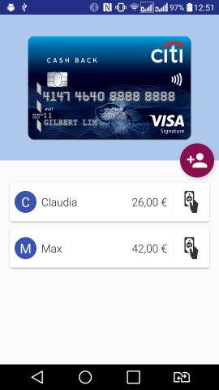
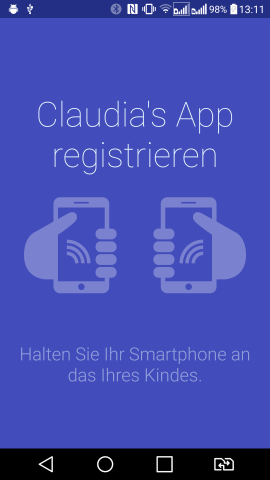
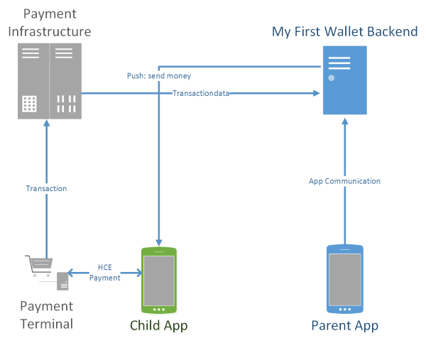

# My First Wallet #Bankathon16

This is the prototype developed during the ["Bankathon16"](https://cashtechthon.inso.tuwien.ac.at/gewinner-2016/) hackathon hosted by [INSO](https://www.inso.tuwien.ac.at/) (Technical University of Vienna). 
It was a 2 day event, 3 developers worked on the project. This project achieved 2nd place in the ranking.

## Use Cases

This is basically a specialized payment and send money app with added functionality to provide this service to a minor with the parents supervision.

### Adding children
An envisioned app for the parents contains an administrative UI where a child can be registered.
To do this the parents mobile phone communicates through NFC with the child's app, automatically
registering it to the parent.

### Sending money
Parents can send money and set restrictions on how the money can be spent (e.g. max daily amount, specific
shops, etc.)

### Pay with children's App
The app can be used to pay at NFC payment terminals. It is implemented to work with simple NFC tags, although HCE is a possible real world solution for this.

### Save money
To learn financial literacy, a child can set a saving goal to set a certain amount of money aside
whenever it feels like it. This amount won't be able to be spent through the payment function. A parent
has to release the money.

## Architecture

### Noteable Technical Details

* Update App through GCM push
* App-to-App and payment with `android.nfc.action.NDEF_DISCOVERED` nfc communication
* Server uses Spring Boot & Postgres as 

## Build & Run

# App 
Use Android Studio and fill with the GCM sender id

    buildConfigField "String", "GCM_PROJECT_ID", "\"FILL_ME\""
    
in the build.gradle.    

# Server

Fill server GCM Api key in class `NotificationService.java`
Use gradle task `bootRun` to start the server.
