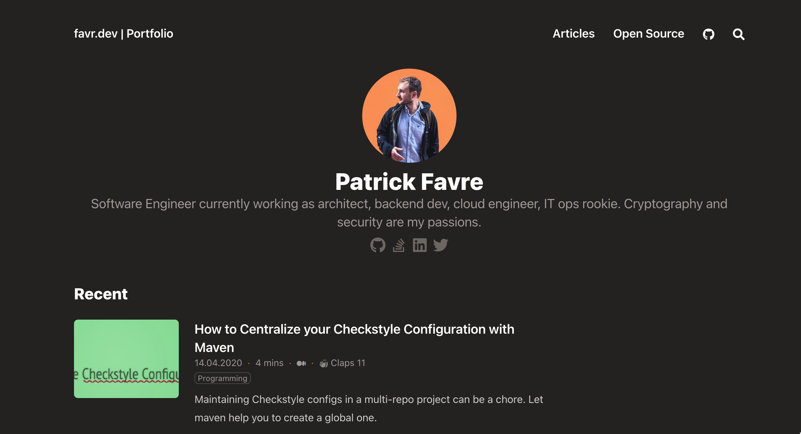

# Static Site Gen Repo for my Personal Website

A simple website with a list of all of my open source projects and articles I wrote. Can be found on [favr.dev](https://favr.dev). Uses [Hugo](https://gohugo.io/) as static site generator.




## Prepare

### Install Hugo

* Windows `choco install hugo-extended`
* Mac `brew install hugo`

### Install Node

Currently, this project uses [Node 18.12.0 (lts)](https://nodejs.org/es/blog/release/v18.12.0). It is recommended to use
a node version manager like [nvm](https://github.com/nvm-sh/nvm), then you can just run

```bash
nvm install && nvm use
```

in the project root dir to install and use the correct version.

### Cloning Project with Submodule

This project uses a git submodule for including the theme. To correctly clone it you need to do

```bash
git clone https://github.com/patrickfav/website-favre.git
git submodule init
git submodule update
```

## Build & Run

### Set secrets

For the downloader to work with all features one must set 2 environmental variables

````bash
GITHUB_TOKEN=... # a GitHub Personal Access Token - https://docs.github.com/de/authentication/keeping-your-account-and-data-secure/creating-a-personal-access-token
FIREBASE_SERVICE_ACCOUNT_JSON= {...} # a Firebase service account json file - https://firebase.google.com/support/guides/service-accounts
````

where the second, the Firebase service account json, is optional and not providing it will disable the stats persisting feature.

### Prepare Content Sync

Install and link everything and build the js files from typescript with

```bash
cd content-downloader
npm run package
```

then either run it with

```bash
hugo-content-downloader
```

or use the shortcut that automatically rebuilds the sources

```bash
npm run exec
```

which will populate the directories `content/opensource` and `content/articles`.

### Linting

This project uses [eslint](https://eslint.org/) to validate the code:

```bash
cd content-downloader
npm runt lint
```

### Using the build & run Docker Image

A docker image that builds everything, updates the content and then can be used to locally serve the website with nginx can be created by doing:

```bash
docker build --no-cache --progress=plain -t websitefavre:latest .
docker run -p 8080:80 websitefavre:latest
```

and then you can access the page with `http://localhost:8080`

# License

Proprietary: Patrick Favre-Bulle 2023
