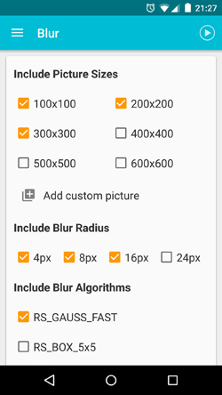
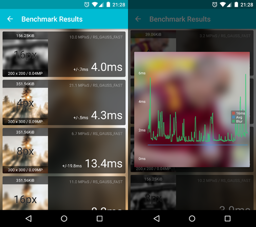
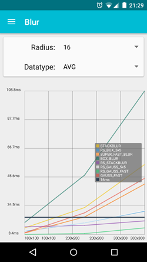
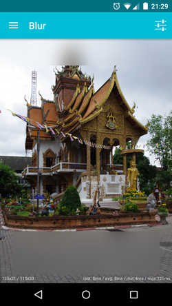
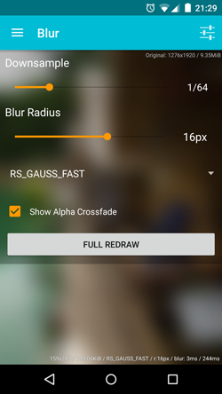

# Blur Benchmark & Showcase for Android

This is a simple benchmark and showcase app on what's possible with blurring in Android 2016. Noteably this app uses Android's Renderscript v8 support library for fast blurring.
Also check out the [Android blur framework Dali](https://github.com/patrickfav/Dali) I'm currently working on, which makes many of the features shown here easy to implement in your own app.

## Download App

The app can be found in the [Playstore](https://play.google.com/store/apps/details?id=at.favre.app.blurbenchmark).

## Blur Benchmark

In this view you chose, the image sizes, blur radii and algorithm you want to benchmark. Finally you decide the benchmark result accuracy by providing the iterations. Be warned, some Java implementations are very slow, so high iterations can take a while to finish.

After running some benchmarks you are presented with the results view, where you can click on each element and see a diagram on the length of each round. This also reveals the benchmarks usually are polluted by heap garbage collection.

Later you can examine the latest benchmarks in a table view or comparative in a diagram with different view options. 

### Details on the Benchmark

A Benchmark consist of blurring a single image a defined number of rounds with a certain pixel radius. Each benchmark has a warm up
phase of a couple of rounds to "warmup" the vm (as recommended here [How do I write a correct micro-benchmark in Java?](http://stackoverflow.com/questions/504103)). The time of each round will
be measured in nanoseconds (if the SDK API Level allows it, else ms). Altough I tryed to prevent recreating expensive objects (bitmap) in every benchmark, the noise of garbage collection is visible especially in the faster runs. So if you see 15-30 ms spikes, this is usually the garbage collector. [The implementation can be found here](BlurBenchmark/src/main/java/at/favre/app/blurbenchmark/BlurBenchmarkTask.java). 
The time of each round will be saved and from this data certain simple statistic can be calculated, like average and 95% confidence intervals.

Here are the explanations of miscellaneous. values

* __MPixel/s__ - the theoretical average performance, similar to the fill rate of a graphics card - how many megapixel per second can be blurred (image width * height / average runtime in sec * 1000)
* __Over 16ms__ - percentage of rounds that were "too slow" for live blurring, eg. slower than 16ms
* __95% [Confidence Intervall](https://en.wikipedia.org/wiki/Confidence_interval)__ - the average +/- the deviance that has 95% of the values
* __[Median](https://en.wikipedia.org/wiki/Median)__ -  the numerical value separating the higher half of a data sample from the lower half

### Used Algorithms (and credits)

* __RS_GAUSS_FAST__ is [ScriptIntrinsicBlur](http://developer.android.com/reference/android/renderscript/ScriptIntrinsicBlur.html) from the Renderscript framework - the default and best/fastest blur algorithm on android
* __RS_BOX_5x5__,__RS_GAUSS_5x5__ are convolve matrix based blur algorithms powerd by Renderscripts [ScriptIntrinsicConvolve](http://developer.android.com/reference/android/renderscript/ScriptIntrinsicConvolve5x5.html) class. The only difference is the used kernels (gaussian matrix and average matrix) of [convolve matrix](http://en.wikipedia.org/wiki/Kernel_(image_processing)). Instead of radius it uses passes, so a radius parameter of 16 makes the convolve algorithm applied 16 times onto the image.
* __STACKBLUR__ found [here](http://www.quasimondo.com/StackBlurForCanvas/StackBlurDemo.html) and a [java implentation from github Yahel Bouaziz](https://github.com/PomepuyN/BlurEffectForAndroidDesign/blob/master/BlurEffect/src/com/npi/blureffect/Blur.java)
* __RS_STACKBLUR__ is the Renderscript implementation of Stackblur from [here](https://github.com/kikoso/android-stackblur/blob/master/StackBlur/src/blur.rs)
* __GAUSS_FAST__ java implementation from [here](http://stackoverflow.com/a/13436737/774398). Fast but ignores edges.
* __BOX_BLUR__ java implementation from  [here](http://stackoverflow.com/questions/8218438). Really slow and under average visual quality.

The implementations can be found [here](BlurBenchmark/src/main/java/at/favre/app/blurbenchmark/blur/algorithms)

## Live Blur

This is a viewpager with a life blur under the toolbar and at the bottom of the window. Live blur means, that the blurring views get updated when the view changes (so viewpager, listview or scrollview gets scrolled). There are also different settings, where you can change the algorithm, blur radius and sample size (the higher, the smaller the used image).

How is this done?

Well, everytime the blur view gets updated, the view will be drawn onto a bitmap (over a canvas) scaled according to the sample size, then cropped, blurred and set as background of the two views.

How can this be reasonable fast?

* use scaled down version of your view
* bitmap reference is reused to possibly prevent some gc
* it has to be on the main thread, any multi threading (even with threadpool) is too slow (meaning the blur view lags behind a good 300ms) probably because of context switching

All in all this can be tweaked so that the blur method only takes around 8-10ms on most devices (with sample settings) which is the targeted runtime for smooth live blurring.
For more tips, check out the [stack overflow post I did on this topic](http://stackoverflow.com/a/23119957/774398)

## Static Blur

This is a simple showcase to check out the different settings (blur radius, algorithm and sample size) and choose the best option for you (quality vs. performance). When pressing "Full redraw" it features a simple alpha blend from sharp to blur.

## Extra Credits

* This project uses a gradle converted version of BraisGabin's project [TableFixHeaders](https://github.com/InQBarna/TableFixHeaders)
* For setting the correct paddings with translucent nav- & systembars jgilfelt's [SystemBarTint](https://github.com/jgilfelt/SystemBarTint) is used
* Additional [Picasso](http://square.github.io/picasso/) and [Jackson](http://jackson.codehaus.org/) is used 

# License

Copyright 2016 Patrick Favre-Bulle

Licensed under the Apache License, Version 2.0 (the "License");
you may not use this file except in compliance with the License.
You may obtain a copy of the License at

    http://www.apache.org/licenses/LICENSE-2.0

Unless required by applicable law or agreed to in writing, software
distributed under the License is distributed on an "AS IS" BASIS,
WITHOUT WARRANTIES OR CONDITIONS OF ANY KIND, either express or implied.
See the License for the specific language governing permissions and
limitations under the License.
