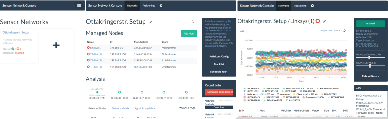
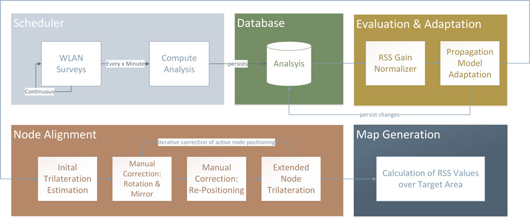
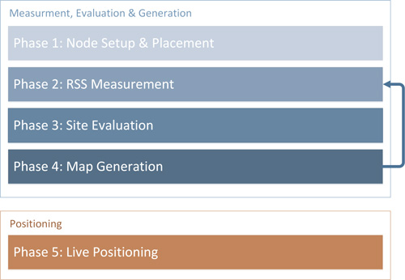
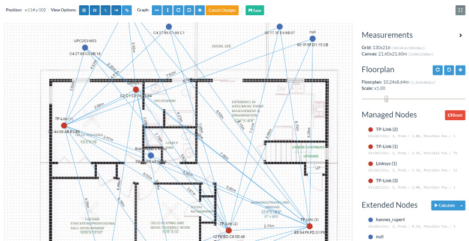
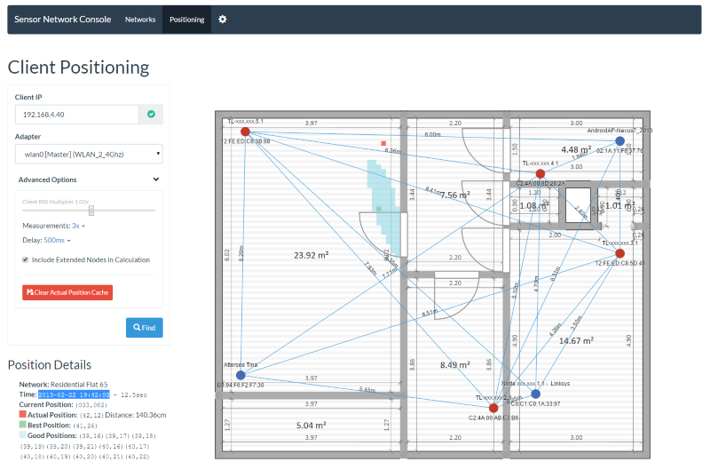
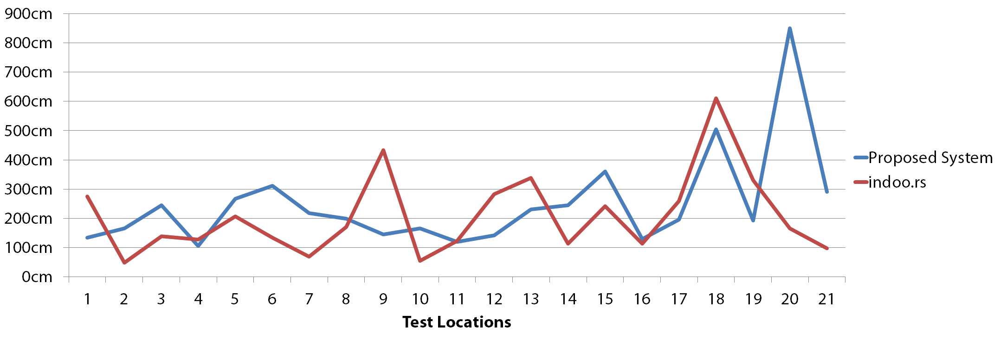
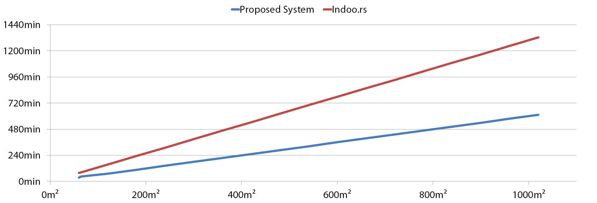

# Introduction
This is a full-featured indoor positioning system that was developed during my master thesis.
Its server component uses servlets and an Angular JS front end, whereas the Router/AP service is written in Lua.

 

# Requirements

## Software

* Java 1.7
* Tomcat 7
* CouchDB 1.5
* Maven 3

## Hardware

* At least 4 OpenWRT compatible AP/Routers in a network with provided custom web services
* At least 1 OpenWrt compatible AP/Router as client with provided custom web services

# Architecture/Procedure

The underlying architecture can be observed in the diagram below.

Overall procedure to map the target area:

1. **Node Setup & RSS Measurement**
Active Nodes, which can be regular access points, are distributed
among the target area. Next a measurement phase is initialized
which takes about one to three hours.

2. **Site Evaluation**
From the resulting data, the underlying radio propagation model
can be adjusted to meet the actual properties of the current site.

3. **Map Generation & Positioning**
With the adapted model, radio wave propagation can be simulated over
a representation of the target area. Positioning works similar to the
scene analysis approach using a modified nearest neighbor algorithm.

# Setup

## Server

Start Tomcat & CouchDB with standard ports. Compile project with

`mvn clean package`

and deploy the *.war on your Tomcat. The DB will be set up automatically, the name of the db will be derived from the
maven <build> -> <finalName>, so if you have a backup change the finalName accordingly.

## AP/Routers

## System Configuration

As prerequisites you must have at least 4 APs ready (with installed webserives) in your network (knowing the IPs of each).

Open the browser and enter the url you deployed the war (usallay something like [http://localhost:8080/MyProject](http://localhost:8080/)).
Create a new network by pressing the box with the "+". Enter the details and set "Surveys Per Node to 100" and "Survey Schedule" to
"Every Minute" to accelerate measurement.
Then next to "Active Nodes", add new nodes with "Add Node". Enter name and IP address, then press "discover" to see if
the node is reachable. After adding all nodes wait a couple of hours to let it measure.

Next press "Schedule Job" -> "Start Single Run Analysis" and wait a couple of seconds. The analysis should appear under
"Analysis", reload page if not. The click "Radio Path Loss Config" and click "Normalize Node Multipliers". In the bottom
 table click on drop-down under "SSID" and choose "Targentdistance". Add the physical distances between nodes in meters
 in the distance matrix or skip the entire step. After entering the distances you can press "Calculate Path Loss Model"
 to optimize the used model -> "Update config".

Next, again, press "Schedule Job" -> "Start Single Run Analysis" and wait a couple of seconds. Select the current analysis
(with the adapted model). Choose "Signal Strength Map" and correct the positions of the active nodes. You may want to upload
a floorplan blueprint first in the network details (the pen icon next to the main header). After that, go to map full screen
mode (four arrows icon). Scale the floorplan with the slider until the meter sizes are correct (you may have to correct the
positions of the Active Nodes again). Then press "Calculate" next to the "Extended Nodes" headers. This will calculate the positions
of all APs/Routers in the vicinity. You may want to correct the positions you know of. Press "save". You now are ready
to position.

# Positioning

You need a AP with the custom webservices installed, same as Active Nodes. This AP must be in your network.

Go to "Positioning". Input the IP of the client (AP) and press "Find". If multiple networks match for this position
you have to select one, otherwise you will be shown a UI with the estimated position. You may press on a square in the grid
to select the actual position to let the system calculate the offset.

# Performance

Properties of the Proposed System

* Adapts well to the specific environment
* Good scalability and low maintenance with easy setup
* Accuracy between 2 to 4 meters on average (see diagram)
* Initial positioning with trilateration works well
* Quality degrades with non-correlating RSS

## Accuracy

The results indicate that the position accuracy offers a performance comparable to
a state-of-the-art solution. The following diagram shows the accumulated offsets
in all test locations.

## Scalability

Based on extrapolated data, the proposed system delivers superior performance in
terms of maintainability and scalability. In the diagram below the required effort
for various target areas is depicted.

# License

Currently proprietary
