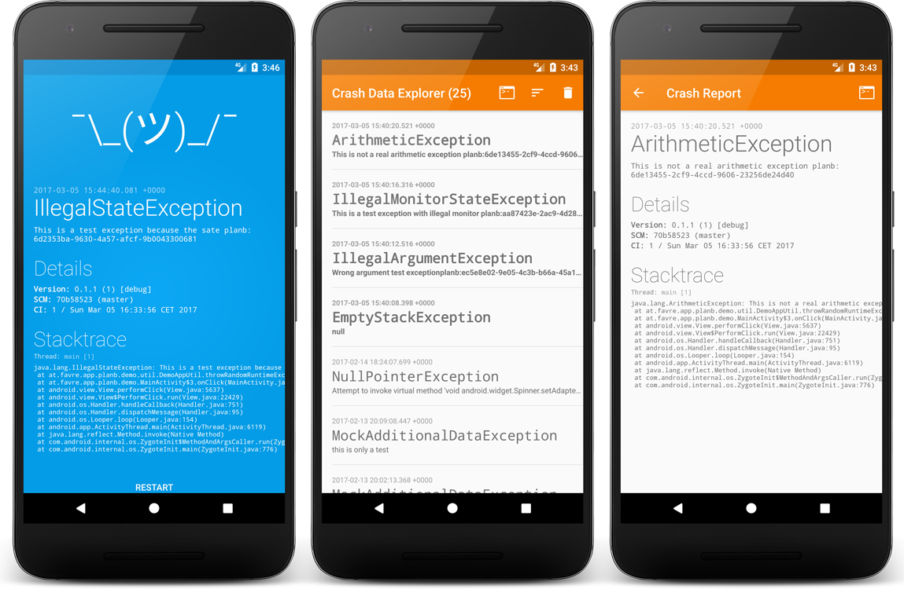

# Plan-B Android Crash Recovery Lib

**THIS IS WORK IN PROGRESS.**

Planb is a crash recovery lib for Android. It helps defining proper behaviour on [uncaught exceptions](http://www.javamex.com/tutorials/exceptions/exceptions_uncaught_handler.shtml) like suppressing the OS dialog or showing an activity with additional debugging info for debug and production builds. Custom crash actions make it easy to inject your own custom code. The lib also persists crashes locally, so it is possible to view them later. This is specifically convenient when multiple people are testing the app. The persistence handler can also be used to informa the user after a crash, so he/she can e.g. create a bug report. This is thought to extend crash reporting frameworks like [hockeyapp](https://hockeyapp.net/) or [crashlytics](https://try.crashlytics.com/).

The lib contains of a `core` library and a full version containing default implementations for debugging crash activity and explorer.

[  ](https://bintray.com/bintray/jcenter/planb/_latestVersion)
[](https://travis-ci.org/patrickfav/planb-android)
[](https://coveralls.io/github/patrickfav/planb-android?branch=master)
[](https://play.google.com/store/apps/details?id=at.favre.app.planb.demo)



## Quick Start

Add the following to your dependencies ([add jcenter to your repositories](https://developer.android.com/studio/build/index.html#top-level) if you haven't)

```gradle
compile 'at.favre.lib:planb:x.y.z'
```

In your [`Application`](https://developer.android.com/reference/android/app/Application.html) implementation initialize PlanB

```Java
@Override
public void onCreate() {
    super.onCreate();
    PlanB.get().init(true,
        PlanB.newConfig(this)
             .applicationVariant(BuildConfig.BUILD_TYPE, BuildConfig.FLAVOR).build());
}
```

Then either in your `Activity.onCreate()` or in the `Application` itself enable the handler

```Java
PlanB.get().enableCrashHandler(this,
    PlanB.behaviourFactory().createRestartForegroundActivityCrashBehaviour());
```

Also check out the [demo app on the Play Store](https://play.google.com/store/apps/details?id=at.favre.app.planb.demo).

# Details

## Built-In Crash Recovery Behaviors

All the built-in behaviour classes can be created with using the `PlanB.behaviourFactory()` or implement the `CrashRecoverBehaviour` interface.

* **Suppress Crash**: does not show any sign of a crash, just closes the app
* **Show Debug Crash Activity**: will show an activity with more info on the crash, useful for development
* **Restart Activity**: will restart the current or launcher (or any other) activity on a crash without showing any error dialog
* **Default Behaviour**: same as not using the lib (excluding from persisting the crashes, etc.), will show the default app crash dialog

You can customize the crash handler with pre and post actions:

Implement a `CrashAction` and pass it to the constructor or factory. The 2 actions will be handled before and after the main `CrashRecoverBehaviour.handleCrash(...)` respectively.

## Note when Restarting after Crash

The `CrashHandler` can be used to check if the app had a crash. Just call `PlanB.get().getCrashDataHandler().hasUnhandledCrash()` to check. Calling this method should reset the unhandled crash flag so subsequent calls will return false.

## Config & CrashDataHandler

The `PlanBConfig` can be used to set your build config so it will be shown and persisted in the debug crash activity. Parameters like, git commit, flavor and ci number can be set.

Crash Handler can be created with the factory found in `PlanB.crashDataHandlerFactory()`. An in-memory implementation exists for production builds where no crash should be persisted.

## Using for debug and production

Per default the lib reads out the "debuggable" flag in the Android Manifest to check if the app is in debug mode. If your app uses a different flag just pass the current state as boolean in the `PlanB.init()` method.

Through the `PlanBConfig` different handlers for production and debug can be set. Additional when enabling the lib with
`PlanB.get().enableCrashHandler(...)` different behaviours can be set for debug and release.

## Using the the Core Module

For minimal impact on dependencies and omitting the built-in activities, the core module can be used:

```gradle
compile 'at.favre.lib:planb-core:x.y.z'
```

It has all the PlanB api methods, without the explorer and default crash debug detail activity.

## Crash Explorer

Using the default `CrashDataHandler` all crashes will be stored in the shared preferences. You can easily view the crashes of that device by starting the explorer:

```Java
CrashExplorerOverviewActivity.start(MainActivity.this);
```

It features details view of the crash, logging the data and sorting it by name or time, as well as clearing all crashes.

## Passing custom data in an Exception

When extending your exception with `ICrashExceptionData` you can add some additional debugging data which will be stored and shown in the crash debug activity.

# Integration with Crash Frameworks

Basically every crash framework sets itself as the default uncaught exception handler (see [`Thread.UncaughtExceptionHandler`](https://docs.oracle.com/javase/7/docs/api/java/lang/Thread.UncaughtExceptionHandler.html)). However the `Thread` object only allows a single handler at a time and there is no support of proper chaining the handlers. Therefore there is no elegant way to use multiple crash frameworks, it usually boils down to the when which framework reads or sets the default handler.

## HockeyApp

## Crashlytics

## Acra

## Similar Projects:

* [Recovery](https://github.com/Sunzxyong/Recovery)

# License

Copyright 2017 Patrick Favre-Bulle

Licensed under the Apache License, Version 2.0 (the "License");
you may not use this file except in compliance with the License.
You may obtain a copy of the License at

    http://www.apache.org/licenses/LICENSE-2.0

Unless required by applicable law or agreed to in writing, software
distributed under the License is distributed on an "AS IS" BASIS,
WITHOUT WARRANTIES OR CONDITIONS OF ANY KIND, either express or implied.
See the License for the specific language governing permissions and
limitations under the License.